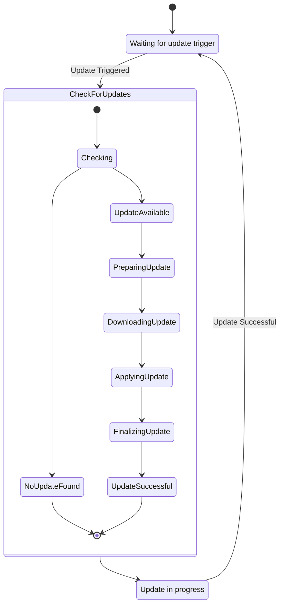

# Proposed: Headless Launcher Backend with Elixir and Server-Side CockroachDB

## Metadata

- **Status:** Proposed
- **Deciders:** V-Sekai Team
- **Tags:** `headless`, `backend`, `launcher`, `updater`

## Backdrop

Introduce a headless backend launcher to automate game updates for enhanced gaming experience.

## Challenge

Build an updater that is simple yet robust, handling automated game updates in the background.

## Strategy

The strategy for this proposal is to develop a headless backend launcher using Elixir and CockroachDB. The main components of the system will be:

The Headless CLI will implement `desync` for data synchronization and provide commands for displaying help information, version information, switching modes, checking current mode, listing all available modes, and updating according to semantic versioning.

The Updater Online Service will be a lightweight service that uses Elixir for handling web requests and CockroachDB for persistence. It will integrate the `desync` protocol and include error handling strategies for failed updates or data synchronization issues.

The GUI Launcher will be designed using the Godot Engine and will also integrate the `desync` protocol. It will feature a basic visual setup with V-Sekai branding.

The Game Sample will involve developing a basic visual sample with V-Sekai branding, planning for testing each component to ensure functionality, addressing security concerns including user data protection and secure updates, and discussing scalability potential with increasing users or larger game updates.

Each table will have its own schema module representing different aspects of the application such as modes, versions, and update processes.

## Upside

This system promotes seamless gaming with high performance and reliability from Elixir and CockroachDB.

## Downside

Technology integration may lead to complex issues and compatibility challenges.

## Road Not Taken

External updaters and manual patches were dismissed for their demanding nature.

## Infrequent Use Case

Design will allow manual update initiation for situations like limited bandwidth.

## Core and Done by Us?

The V-Sekai team will develop and maintain this launcher backend. A detailed maintenance plan will be provided.

## Documentation

A comprehensive documentation will be created for understanding the system and onboarding new team members.

## Further Reading

- [**V-Sekai GitHub**](https://github.com/v-sekai) - Our efforts in VR using Godot Engine.
- [**V-Sekai Game Repo**](https://github.com/v-sekai/v-sekai-game) - Our open-source VR and social experiences project.
- [**Desync**](https://github.com/folbricht/desync) - Alternative casync implementation.

## Code Snippets



Use Elixir for concurrent services and CockroachDB on the server for data management:

1. **Headless CLI**

   - Implement desync for data synchronization.
   - Detail how desync will be integrated into the service and GUI.

```bash
# Display help information
vsekai --help

# Display version information
vsekai --version

# Switch to a different mode. Modes allow different operations for the software.
vsekai mode switch --mode_name stable

# Check the current mode.
vsekai mode current

# List all available modes.
vsekai mode list

# Always updates according to semantic versioning to the mode.
./headless-vsekai-v0.1.0.exe --update C:/v-sekai/launcher
./headless-vsekai-v0.1.1.exe --update C:/v-sekai/launcher
./headless-vsekai-v0.2.0.exe --update C:/v-sekai/launcher

# Pseudo code for update process
check_launcher_folder()
validate_manifest_file_and_version()
ensure_correct_files_for_update()
download_to_temp()
delete_old_and_move_over()
setup_registry_values()
```

2. **Updater Online Service:**

   - Create a lightweight updater service.
   - Use Elixir for web requests handling.
   - Utilize server-side CockroachDB for persistence.
   - Integrate desync protocol in the Service.
   - Include error handling strategy for failed updates or data synchronization issues.

3. **GUI Launcher Creation:**

   - Design an intuitive Godot Engine GUI launcher.
   - Integrate desync protocol in the GUI.
   - Detail the basic visual setup with V-Sekai branding.

4. **Game Setup Efforts:**
   - Develop a basic visual setup with V-Sekai branding.
   - Include a plan for testing each component to ensure functionality.
   - Address security concerns, including user data protection and secure updates.
   - Discuss scalability potential with increasing users or larger game updates.

### Data model in the database

#### Modes Table

```elixir
defmodule VSekaiNebula.Mode do
  @moduledoc """
  This module represents the `modes` table in the application's database.

  ## Fields

  - `:name`: The name of the mode.
  - `:is_active`: A boolean indicating whether the mode is active or not.
  - `:update_to`: Updates to a different mode.
  - `:id`: A unique identifier for each mode. It is autogenerated and serves as the primary key.
  """

  use Ecto.Schema

  schema "modes" do
    field :name, :string
    field :is_active, :bool
    field :update_to, Ecto.UUID
    field :id, Ecto.UUID, autogenerate: true, primary_key: true

    timestamps()
  end

  # TODO changeset/2
end
```

#### Version Table

```elixir
defmodule VSekaiNebula.Version do
  @moduledoc """
  This module represents the `versions` table in the application's database.

  ## Fields

  - `:version`: The version number.
  - `:skip_update`: A boolean indicating whether to skip the update or not.
  - `:manifest_file_uri`: The URI of the manifest file. This is generated server-side to ensure integrity,
    especially during CI/CD processes. It helps prevent issues such as network errors, mid-process failures,
    or programming errors causing incorrect checksums or file locations.
  - `:id`: A unique identifier for each version. It is autogenerated and serves as the primary key.

  ## Associations

  - belongs_to :mode, VSekaiNebula.Mode: Each version is associated with a mode.
  """

  use Ecto.Schema

  schema "versions" do
    field :version, :string
    field :skip_update, :bool
    field :manifest_file_uri, :string
    field :id, Ecto.UUID, autogenerate: true, primary_key: true

    belongs_to :mode, VSekaiNebula.Mode

    timestamps()
  end

  # TODO changeset/2
end
```

#### Files Table

```elixir
defmodule VSekaiNebula.Files do
  @moduledoc """
  This module represents the `files` table in the application's database.

  ## Fields

  - `:file_name`: The name of the file.
  - `:file_uri`: The URI of the file.
  - `:file_checksum_hash`: The checksum hash of the file.
  - `:id`: A unique identifier for each file. It is autogenerated and serves as the primary key.

  ## Associations

  - belongs_to :version, VSekaiNebula.Version: Each file is associated with a version.

  ## Reasoning

  - Timestamps are removed as they are not necessary for this table. The files are static and do not change over time.
  """

  use Ecto.Schema

  schema "files" do
    field :file_name, :string
    field :file_uri, :string
    field :file_checksum_hash, :string
    field :id, Ecto.UUID, autogenerate: true, primary_key: true

    belongs_to :version, VSekaiNebula.Version
  end

  # TODO changeset/2
end
```

### CDN Table

```elixir
defmodule VSekaiNebula.CDN do
  @moduledoc """
  This module represents the `cdn` table in the application's database.

  ## Fields

  - `:uid`: The unique identifier of the CDN.
  - `:name`: The name of the CDN.
  - `:uri`: The URI of the CDN.
  - `:last_checked_on`: The date and time when the CDN was last checked. This field is necessary as the CDN details are checked regularly and we need to keep track of when they were last checked.
  - `:region`: The region where the CDN is located.
  - `:id`: A unique identifier for each CDN. It is autogenerated and serves as the primary key.

  ## Reasoning

  - Traditional timestamps (created_at, updated_at) are removed as they are not necessary for this table. The CDN details are static and do not change over time, except for the `:last_checked_on` field which is updated regularly.
  """

  use Ecto.Schema

  import Ecto.Changeset

  schema "cdn" do
    field :uid, :string
    field :name, :string
    field :uri, :string
    field :last_checked_on, :utc_datetime
    field :region, :string
    field :id, Ecto.UUID, autogenerate: true, primary_key: true
  end

  # TODO changeset/2
end
```
