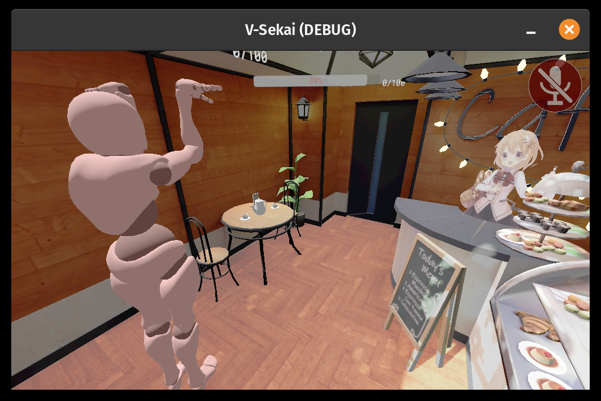

# V-Sekai Changelog - 2022-05

## 2022-05-29

https://github.com/V-Sekai/godot-seurat is dependent on being able to fetch 16 bit float buffers https://github.com/godotengine/godot/issues/54122#issuecomment-1140414946.

## 2022-05-29

1. Investigated technical art via breaking apart the cafe
2. Investigated [DagAmendment](https://github.com/eliemichel/DagAmendment) for brush based refinement of csg shapes.

## 2022-05-26

1. Characters now load but the pose is incorrect.
2. Maps load from a new sdk uploader.
3. The content picker is bad and ugly but usable to pick maps to host and choose avatars.
4. The server sees all clients but the clients only see the server and not each other.
5. The vr pose is incorrect but you can see the error so it hasn't catastrophically exploded.

## 2022-05-07

Completed a first stage EWBIK inverse kinematics solver to the stage one which solves but doesn't have constraints.
