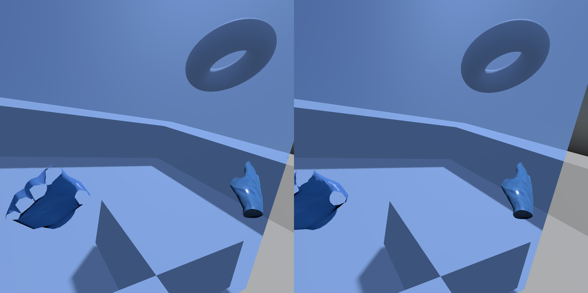

# V-Sekai Changelog - 2022-12

This is the changelog for December 2022.

# 2022-12-05

Restored AEC3 to speech for echo cancellation.

# 2022-12-06

Some reorganization of the the V-Sekai-game issues and the proposal repository to move bugs to V-Sekai-game and enhancements to the proposal repository. Organized the issues and put some videos for some of them. The Japanese tokyo world bug with the 30 second lag between load was funny.

Moved enhancements to https://github.com/V-Sekai/V-Sekai.github.io and bugs to https://github.com/V-Sekai/v-sekai-game/issues.

Godot Speech now includes echo cancellation using WebRTC AEC3. Thanks iFire for adding it and getting it building. (some of the builds had issues but they should be resolved) .

# 2022-12-12

MMMaellon updated the V-Sekai game fov to 70.

Lyuma — Today at 00:34

We had an animation meeting with people in the Godot rocketchat.

We went through the issues in this list:
https://docs.google.com/spreadsheets/d/16Al_PUHAUJE0S3XXtBpmA6MQIA_9sx57BXEisW1EAB0/edit#gid=0
Google Docs
(Saracen / Lyuma / Fire / Tokage) A list of open issues/bugs/PRs th...

Pretty excited about some of these changes if they can get merged, especially the ability to extend and override AnimationNode classes, such as from a GDExtension plugin

We agreed to punt SkeletonModificationStack3D until 4.1. I think we will remove it from 4.0 because it is very buggy in its present state and there is not enough time to develop a good system for IK

# 2022-12-15

<Lyuma\> Engine patch: https://github.com/V-Sekai/godot/tree/override_projection
VR Demo branch based on Saracen's code: https://github.com/V-Sekai/avatar_vr_demo/tree/screenspace_mirror It's missing some of the newer changes but anyway that's what I have.
