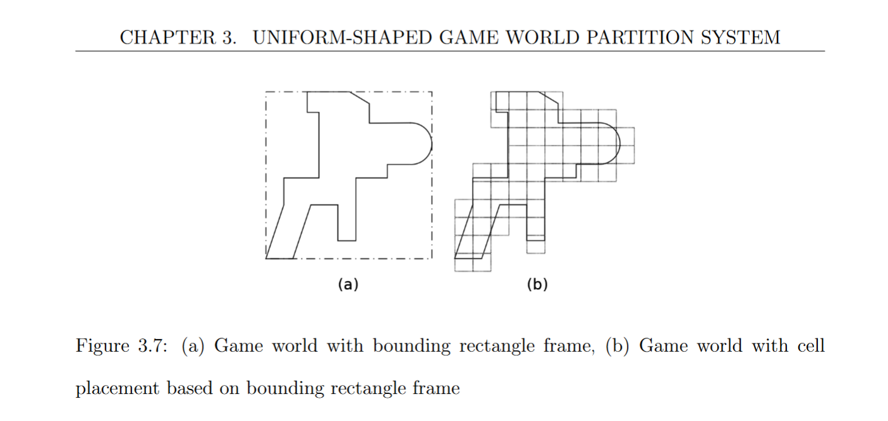
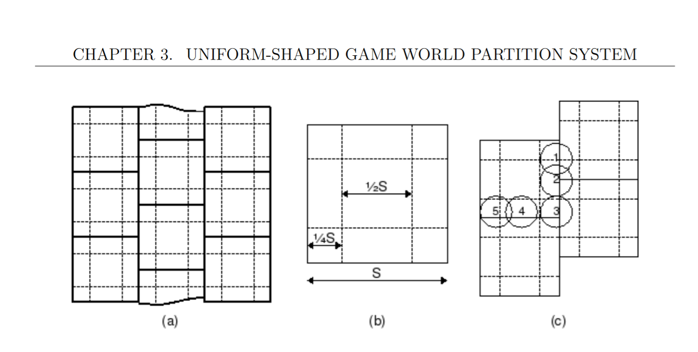
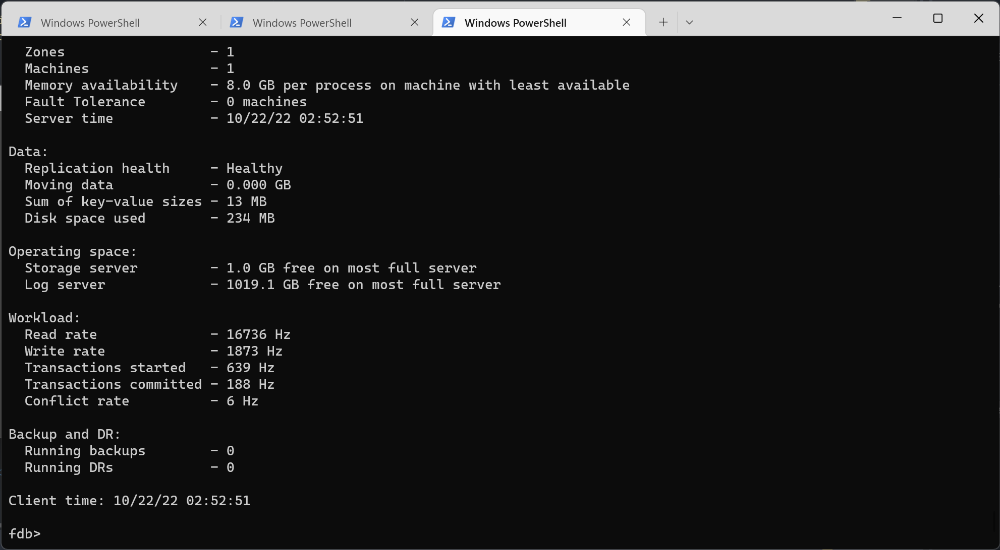

# Simulate larger worlds using "brickworlds partition layout"

- Status: draft <!-- draft | proposed | rejected | accepted | deprecated | superseded by -->
- Deciders: V-Sekai,
- Tags: V-Sekai,

## Context and Problem Statement

Each V-Sekai game server has a scalability limit. Transfer each player to a different server when needed.

<!-- Describe the problem or limitation you are having in your project. You may want to articulate the problem in the form of a question. -->

## Describe the proposed option and how it helps to overcome the problem or limitation

Transfer the state using a database that can handle commits in commit order despite parallel transactions.

## Describe how your proposal will work, with code, pseudo-code, mock-ups, or diagrams

1. Partition the world into tiles

2. Define the tiles with a premigration and migration border.

3. Transfer the player from one server to another by first syncing all the frames, and have the player connect to the other side. Then the server does the transfer and the player connects to the other side when the migration boundary is hit.

4. Test using a multiplayer simulator.

## Positive Consequences <!-- improvement of quality attribute satisfaction, follow-up decisions required -->

- Allows player transfer from one server to the others servers.

## Negative Consequences <!-- compromising quality attribute, follow-up decisions required -->

- Needs to connect the servers to the foundation database simulation servers.

## Option graveyard:

- Option: The status quo. <!-- List the proposed options no longer open for consideration. -->
- Rejection Reason: This solves nothing. <!-- List the reasons for the rejection: (the bad traits) -->

## If this enhancement will not be used often, can it be worked around with a few lines of script?

It's not a few lines of script.

## Is there a reason why this should be core and done by us?

We own the networking stack.

## References

- [V-Sekai](https://v-sekai.org/)
- [Efficient_Methods_for_Improving_Scalability_and_Playability_of_Massively_Multiplayer_Online_Game_MMOG by Prasetya, Kusno](https://pure.bond.edu.au/ws/portalfiles/portal/18275482/Efficient_Methods_for_Improving_Scalability_and_Playability_of_Massively_Multiplayer_Online_Game_MMOG_.pdf)
- [godot sqlite mvsqlite](https://github.com/V-Sekai/godot-sqlite/tree/mvsqlite)
- [mvsqlite](https://github.com/losfair/mvsqlite)
- [Apple's foundationdb](https://github.com/apple/foundationdb)
- [Rust lang](https://www.rust-lang.org/)

## License of the contribution

Copyright (c) 2022 V-Sekai contributors.

Permission is hereby granted, free of charge, to any person obtaining a copy of this software and associated documentation files (the "Software"), to deal in the Software without restriction, including without limitation the rights to use, copy, modify, merge, publish, distribute, sublicense, and/or sell copies of the Software, and to permit persons to whom the Software is furnished to do so, subject to the following conditions:

The above copyright notice and this permission notice shall be included in all copies or substantial portions of the Software.

THE SOFTWARE IS PROVIDED "AS IS", WITHOUT WARRANTY OF ANY KIND, EXPRESS OR IMPLIED, INCLUDING BUT NOT LIMITED TO THE WARRANTIES OF MERCHANTABILITY, FITNESS FOR A PARTICULAR PURPOSE AND NONINFRINGEMENT. IN NO EVENT SHALL THE AUTHORS OR COPYRIGHT HOLDERS BE LIABLE FOR ANY CLAIM, DAMAGES OR OTHER LIABILITY, WHETHER IN AN ACTION OF CONTRACT, TORT OR OTHERWISE, ARISING FROM, OUT OF OR IN CONNECTION WITH THE SOFTWARE OR THE USE OR OTHER DEALINGS IN THE SOFTWARE.
