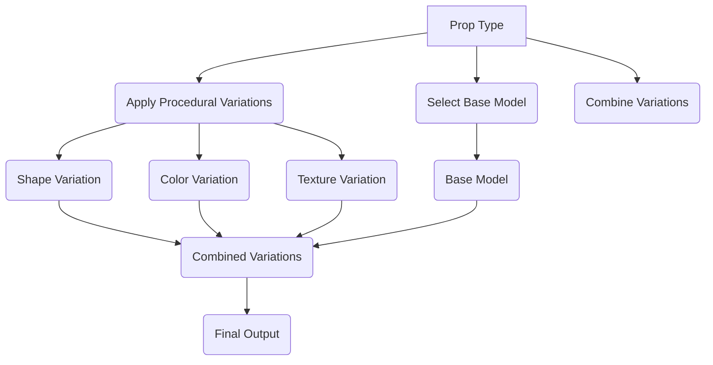

# Proposed: Procedurally create variations for our props, environments and avatars

### Metadata

- Status: proposed <!-- draft | proposed | rejected | accepted | deprecated | superseded by -->
- Deciders: V-Sekai,fire,
- Tags: V-Sekai,chatgp4,

### Context and Problem Statement

Lack of variety and customization in V-Sekai's 3D props, environments, and avatars.

### Describe the proposed option and how it helps to overcome the problem or limitation

Introducing a procedural generator for 3D props, environments, and avatars in V-Sekai will significantly enhance user experience by offering a broad range of customizable options. Procedural generation is an algorithmic method of content creation that replaces manual design, resulting in a larger array of unique combinations.

The procedural generator can be developed using a mix of algorithms, libraries, and assets to produce a vast assortment of variations for props, environments, and avatars. Users' input parameters, such as prop type, color, size, and material, will guide the generator in crafting distinctive content.

### Describe how your proposal will work, with code, pseudo-code, mock-ups, or diagrams

This flowchart demonstrates the procedural generation process using the following steps:

1. User Input Parameters: Users provide their preferences for prop type, color, size, and material.
2. Select Base Model: The generator selects a base model corresponding to the chosen prop type.
3. Apply Procedural Variations: The generator applies algorithmic variations to the base model, modifying its shape, color, and texture based on user input.
4. Combine Variations: The generator combines these variations to create a unique prop with the specified properties.
5. Generate Unique Prop, Environment, or Avatar: The final output is a unique prop, environment, or avatar that meets the user's preferences.

This approach increases the variety and customization options in V-Sekai, enhancing the platform's appeal and offering a more engaging experience for users.

### Positive Consequences

1. Enhanced variety: Procedural generation enables a wide array of unique content, delivering a diverse and constantly evolving experience for users.
2. User personalization: By incorporating user preferences, the generator can produce content that aligns with individual tastes and needs.
3. Efficient resource utilization: Procedural content generation minimizes the need for manual design and asset creation, leading to a more cost-effective platform.

### Negative Consequences

1. Complexity: Developing a procedural generator can be intricate, necessitating expertise in algorithms, 3D modeling, and other technical domains.
2. Performance impact: Real-time content generation might affect performance, particularly if algorithms are not optimized or if the platform experiences high user traffic.

### Option graveyard

Do nothing.

### If this enhancement will not be used often, can it be worked around with a few lines of script?

This is a few lines of code.

### Is there a reason why this should be core and done by us?

We care about v-sekai more than others.

### References

- [V-Sekai](https://v-sekai.org/)
