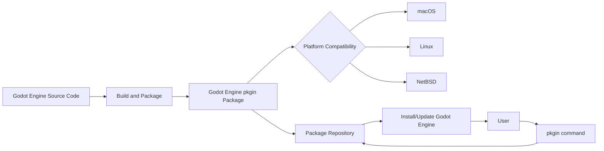

# Rejected: Package Godot for pkgin

### Metadata

- Status: rejected <!-- draft | proposed | rejected | accepted | deprecated | superseded by -->
- Deciders: V-Sekai,fire,
- Tags: V-Sekai,chatgpt4,

### Context and Problem Statement

According to Netflix, the BSD-type operating systems are competitive, and supporting pkgsrc is an excellent way to start.

> pkgsrc is a framework for managing third-party software on UNIX-like systems containing over 26,000 packages. It is the default package manager of [NetBSD](https://www.netbsd.org/) and [SmartOS](https://wiki.smartos.org/) and can be used to enable freely available software to be built quickly on a large number of other UNIX-like platforms.

> V-Sekai is developing a free, open-source virtual reality platform. We work to make it user-friendly and fulfill a need in the VR community.

### Describe the proposed option and how it helps to overcome the problem or limitation

1. Effortless installation and updates: Packaging Godot Engine for pkgin makes it easier to install and update the software on macOS, Linux, and NetBSD, offering a smooth experience for users at all expertise levels.
2. Wider platform support: By embracing pkgsrc and packaging Godot Engine for pkgin, compatibility with an array of UNIX-like systems is ensured, broadening the user base and fostering adoption across different platforms.
3. Promoting cooperation: V-Sekai's support for pkgsrc and packaging of the Godot Engine for pkgin enables collaboration through the vast third-party software ecosystem available for UNIX-like systems, stimulating the exchange of ideas and resources.
4. Reinforcing open-source ideals: V-Sekai's decision to package the Godot Engine for pkgin strengthens its commitment to open-source values like accessibility, transparency, and community-driven development, enhancing growth within the VR community.

### Describe how your proposal will work with code, pseudo-code, mock-ups, or diagrams

### Positive Consequences

1. Easy installation and updates: Pkgin support simplifies installing and updating the Godot Engine on UNIX-like systems, such as macOS, Linux, and NetBSD, providing a hassle-free experience for users.

2. Wide platform support: Pkgin compatibility ensures that the Godot Engine works seamlessly with multiple UNIX-like systems, expanding the user base and promoting adoption across various platforms.

3. Efficient dependency handling: Pkgin automatically manages dependencies, streamlining the installation process and minimizing conflicts or issues due to unmet requirements.

4. Uniform software environment: Pkgin helps maintain consistency in software versions and configurations, which is crucial for collaboration and reducing the need for troubleshooting.

5. Connection to the pkgsrc ecosystem: Supporting pkgin allows users to tap into the extensive third-party software ecosystem for UNIX-like systems, fostering the exchange of ideas and resources within the open-source community.

6. Resource and time savings: By offering pkgin support, developers can concentrate on enhancing the Godot Engine and V-Sekai's VR platform features rather than manually managing software installations and updates.

7. Emphasizing open-source principles: By endorsing pkgin, both V-Sekai and the Godot Engine reaffirm their commitment to open-source values, such as accessibility, transparency, and community-driven development, fostering growth and collaboration within the VR community.

### Negative Consequences

There are some potential downsides to packaging the Godot Engine for pkgin, which include:

Additional maintenance work: Supporting pkgin may necessitate regular package updates to ensure compatibility with different systems and to keep up with new Godot Engine versions and features. This could require extra time and resources from the development team.

Incomplete platform support: Pkgin is designed for UNIX-like systems, but it doesn't directly cater to users on other platforms, such as Windows. Supporting alternative package managers for non-UNIX platforms may demand extra efforts.

User learning curve: Users unfamiliar with pkgin or pkgsrc might need to invest time in learning to use the package manager effectively, which could pose a barrier for some users, particularly those new to UNIX-like systems or with limited package management experience.

Potential compatibility challenges: While pkgin aims to provide compatibility across various UNIX-like systems, certain configurations or system setups may still pose difficulties. Addressing these issues might require more development and troubleshooting efforts.

Unnecessary overhead for small projects: For smaller projects or users with minimal requirements, the added features and capabilities provided by pkgin support might be excessive. In such cases, the effort needed to maintain and use a pkgin package could outweigh its benefits.

Despite these potential downsides, offering pkgin support can bring significant advantages, such as streamlining installation and updates, ensuring compatibility with UNIX-like systems, and promoting collaboration within the open-source community.

### Option graveyard

Alternative package managers: While other package managers like apt or yum might have been considered, they may need to provide different compatibility with BSD-type systems than pkgsrc. Pkgin, designed for pkgsrc, is the default package manager for systems like NetBSD and SmartOS, making it the ideal choice.

Manual installation: Requiring users to compile and install Godot Engine manually would complicate the process and be less user-friendly, particularly for novices. This approach could also result in software version inconsistencies and configuration issues, affecting user experience.

Custom package manager: Developing a custom package manager specifically for V-Sekai's platform is resource-intensive and duplicates existing package managers' efforts, such as pkgin, which already offers compatibility with BSD-type systems.

Exclusively focusing on other platforms: By targeting only Linux, macOS, or Windows, V-Sekai would limit its potential user base and overlook the advantages of supporting UNIX-like systems like NetBSD and SmartOS. So instead, packaging Godot Engine for pkgin enables V-Sekai to reach a wider audience using BSD-type operating systems.

### If this enhancement will be used infrequently, can it be worked around with a few lines of script?

Using a script for Godot Engine may have drawbacks, such as being less user-friendly, requiring more maintenance, having limited compatibility with BSD-type systems, and potentially impacting integration with the pkgsrc ecosystem.

### Is there a reason why this should be core and done by us?

Packaging the Godot Engine for pkgin as a core task our team handles ensures quality control, streamlined support, customization, alignment with your platform's vision, and trust-building with users. These factors contribute to the overall success and adoption of your open-source virtual reality platform.

### References

- [V-Sekai](https://v-sekai.org/)
- https://pkgsrc.joyent.com/
