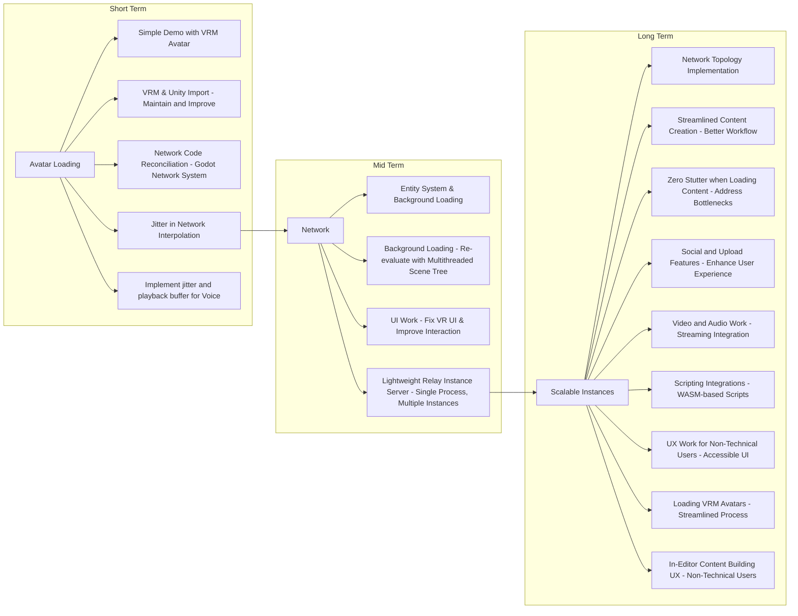

# Superseded: V-Sekai Roadmap and Goals 2023-04-20

### Metadata

- Status: superseded by 20230516-v-sekai-roadmap.md <!-- draft | proposed | rejected | accepted | deprecated | superseded by -->
- Deciders: V-Sekai,fire,lyuma,
- Tags: V-Sekai,chatgpt4 summary,

### Context and Problem Statement

What is the V-Sekai Roadmap and Goals?

### Describe the proposed option and how it helps to overcome the problem or limitation

The roadmap presented here is divided into three stages: short-term, mid-term, and long-term goals. Each stage builds upon the previous one, gradually expanding the project's scope and capabilities.

### Describe how your proposal will work with code, pseudo-code, mock-ups, or diagrams

The discussion involves the development of V-Sekai, a project with short-term, mid-term, and long-term goals. In the short term, the focus is on avatar loading, simple demos, VRM & Unity import, network code reconciliation, adding network interpolation, and voice jitter buffer. Mid-term goals include working on the network, entity system, background loading, UI improvements, and developing a lightweight relay instance server. Finally, long-term goals involve scalable instances, network topology implementation, streamlined content creation, zero stutter loading, enhancing social and upload features, video and music playback and live streaming, scripting integrations, UX work for non-technical users, and in-editor content building UX.

One challenge the project faces is maintaining and improving the existing codebase, which includes outdated workarounds from Godot 3. Another setback was the change from OpenVR to OpenXR. Content is another hurdle: transferring a world from other platforms to V-Sekai is currently best accomplished by exporting source assets such as glTF or FBX. The project aims to cater to non-technical users, making it more accessible than other platforms. WASM-based scripting is being considered, but there are concerns about implementation challenges and security.

In addition, the V-Sekai project needs a project manager, and the team struggles to find collaborators who share their vision and can dedicate enough time to contribute significantly. Nevertheless, despite the long list of features needed for basic functionality, the team believes that V-Sekai is essential for the future of the Metaverse space, and that will draw collaborators to assist on our common vision.

It's important that our roadmap and goals continue to be discussed and iterated on. Nothing should be seen as final, since technology changes so rapidly and consensus is important.

### Positive Consequences

We can create V-Sekai easier.

### Negative Consequences

Overhead might be hard.

### Option graveyard

- Relying on informal communication and ad-hoc collaboration
- Continuing with the current approach without a structured process

### If this enhancement will be used infrequently, can it be worked around with a few lines of script?

No. This is a process.

### Is there a reason why this should be core and done by us?

This is a core process for V-Sekai.

### References

- [V-Sekai](https://v-sekai.org/)
