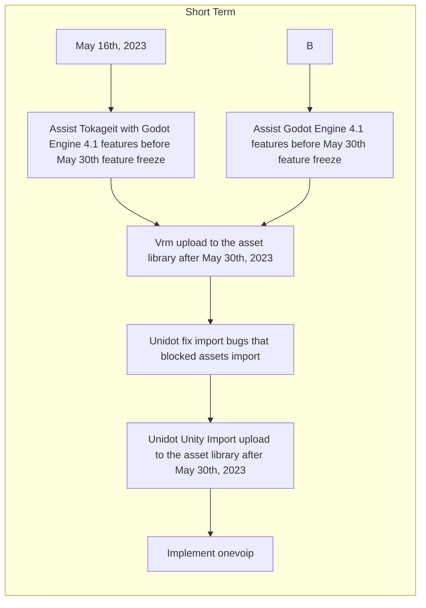

# Superseded: V-Sekai Roadmap and Goals 2023-05-19

### Metadata

- Status: superseded by `20230527-v-sekai-roadmap.md` <!-- draft | proposed | rejected | accepted | deprecated | superseded by -->
- Deciders: V-Sekai,fire,lyuma,
- Tags: V-Sekai,chatgpt4 summary,

### Context and Problem Statement

What is the V-Sekai Roadmap and Goals?

### Describe the proposed option and how it helps to overcome the problem or limitation

The roadmap presented here is short-term.

### Describe how your proposal will work with code, pseudo-code, mock-ups, or diagrams

### Positive Consequences

We can create V-Sekai easier.

### Negative Consequences

Overhead might be hard.

### Option graveyard

- Implementing a custom voice chat solution instead of using onevoip
- Waiting for Godot Engine 4.2 instead of assisting with 4.1 features
- Ignoring SkeletonIK3D issues and focusing on other aspects

### If this enhancement will be used infrequently, can it be worked around with a few lines of script?

No. This is a process.

### Is there a reason why this should be core and done by us?

This is a core process for V-Sekai.

### References

- [V-Sekai](https://v-sekai.org/)
