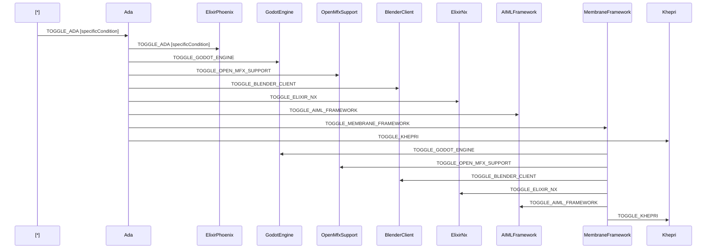

# Networked Procedural Generation as a Sidecar to the Godot Engine Server

## Metadata

- Status: proposed
- Deciders: V-Sekai, fire
- Tags: V-Sekai, Chatbot GPT4 assistance, xstate typescript

## Context and Problem Statement

Enable creation of more dynamic and engaging environments within V-Sekai.

## Proposed Solution

V-Sekai, an open-source virtual reality platform, aims to deliver a user-friendly experience for the VR community. To boost its functionality and compatibility with other tools, we propose integrating networked procedural generation as a sidecar to the Godot engine server, allowing for more dynamic and immersive environments in V-Sekai.

To further address V-Sekai's limitations, we suggest incorporating the Membrane Framework along with other relevant technologies such as Godot Engine, OpenMfx Support, Elixir Phoenix, and Elixir Nx. This comprehensive integration will not only enhance V-Sekai's capabilities but also increase its versatility across various use cases.

The implementation involves connecting V-Sekai with the components mentioned in the Membrane Framework diagram below:

In this diagram, Alice, Bob, Carol, and BlenderClient can act as both sources and sinks. The other components are filters that process the data between the sources/sinks.

By integrating these components, V-Sekai will benefit from the features and enhancements provided by each technology, such as Godot Engine's native glTF exporter, OpenMfx support for Blender, C++, and Houdini, and Elixir Phoenix and Nx for web applications and numerical computing.

## Positive Consequences

- Improved functionality and versatility of V-Sekai
- Enhanced compatibility with other tools and platforms
- Greater potential for collaboration and community involvement

## Negative Consequences

- Increased complexity in implementation and maintenance
- Potential performance overhead due to integration of multiple components

## Option graveyard

## Option Graveyard

1. **Standalone procedural generation**: Implementing procedural generation as a standalone feature without integrating it with the Godot Engine server. This option was discarded because it would not provide the same level of compatibility and versatility as the proposed solution.

2. **Using pre-built assets**: Relying on pre-built assets for creating environments instead of implementing networked procedural generation. This option was discarded due to the limited flexibility and potential for repetitive content, which could negatively impact user engagement.

3. **Third-party procedural generation tools**: Integrating third-party procedural generation tools instead of developing a custom solution. This option was discarded because it may not offer the same level of control and customization required for V-Sekai's specific needs.

4. **Static environment design**: Focusing on static environment design rather than dynamic, procedurally generated content. This option was discarded because it would not provide the desired level of immersion and interactivity for V-Sekai users.

## If this enhancement will be used infrequently, can it be worked around with a few lines of script?

No, the proposed solution involves integrating multiple technologies and cannot be achieved with a simple script workaround.

## Is there a reason why this should be core and done by us?

Yes, addressing the limitations of V-Sekai is crucial for its success and adoption within the VR community. By integrating the proposed technologies, we can ensure that V-Sekai remains competitive and relevant in the rapidly evolving VR landscape.

## References

- [V-Sekai](https://v-sekai.org/)
