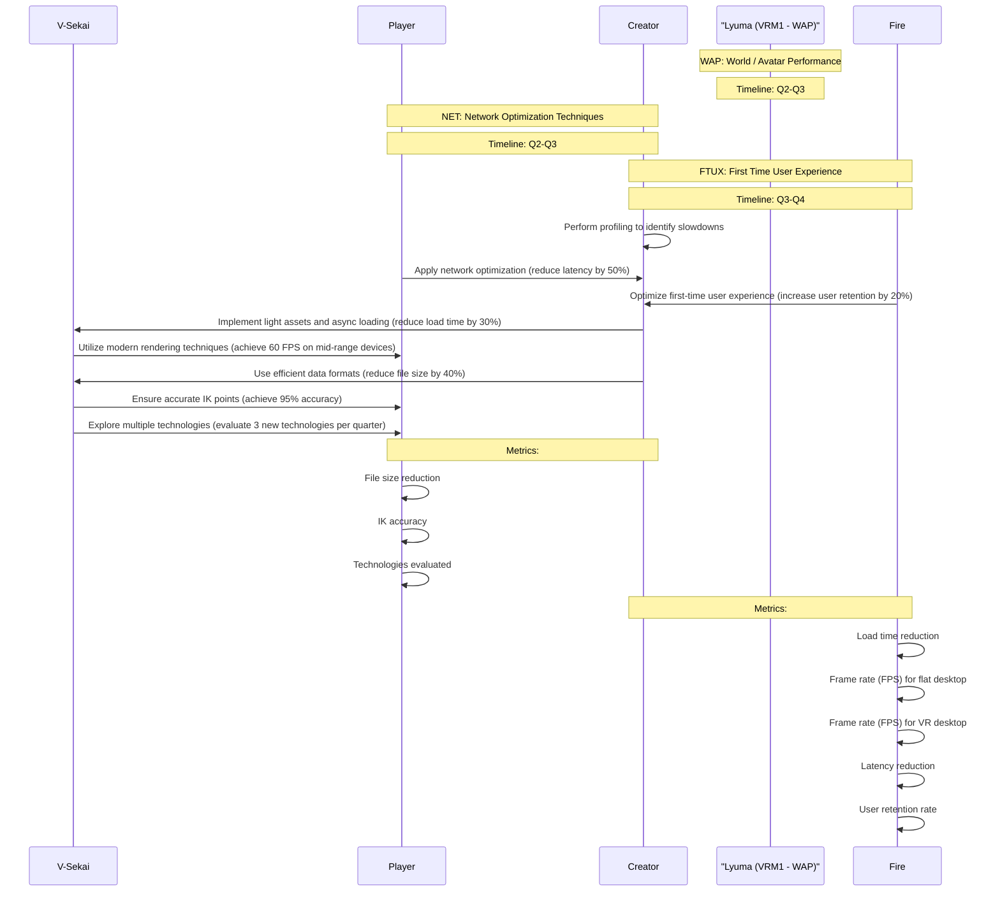

# V-Sekai Roadmap and Goals 2023-06-24

### Metadata

- Status: accepted
- Deciders: V-Sekai, fire
- Tags: V-Sekai, chatgpt4 summary,

### Context and Problem Statement

What is the V-Sekai Roadmap and Goals?

### Describe the proposed option and how it helps to overcome the problem or limitation

The roadmap presented here is short-term.

### Describe how your proposal will work with code, pseudo-code, mock-ups, or diagrams

By avoiding work on User Generated Content (UGC) and world building, we can prioritize the three main states in the roadmap: "World / Avatar Performance" (WAP), "Networking" (NET), and "UI/UX". This allows the team to focus on the core aspects of V-Sekai and achieve the goals more efficiently.

### Goals

#### World / Avatar Performance (WAP)

- Timeline: Q2-Q3
- Implement light assets and asynchronous loading to reduce load time by 30%
- Utilize modern rendering techniques and high-performance libraries to achieve 60 FPS on mid-range devices
- Apply network optimization and low latency protocols for better performance, reducing latency by 50%

#### Networking (NET)

- Timeline: Q2-Q3
- Use efficient data formats and optimized compression algorithms to reduce file size by 40%
- Ensure accurate IK points are respected, achieving 95% accuracy
- Explore multiple technologies and alternative solutions for continuous improvement, evaluating 3 new technologies per quarter

#### First Time User Experience (FTUX)

- Timeline: Q3-Q4
- Optimize first-time user experience by improving the loading process, increasing user retention by 20%

#### Diagram

### Positive Consequences

- Easier creation of V-Sekai.
- Focused development on core aspects.

### Negative Consequences

- Potential overhead challenges.

### Option graveyard

- Waiting for Godot Engine 4.2 instead of assisting with 4.1 features.

### If this enhancement will be used infrequently, can it be worked around with a few lines of script?

No. This is a process.

### Is there a reason why this should be core and done by us?

This is a core process for V-Sekai.

### References

- [V-Sekai](https://v-sekai.org/)
