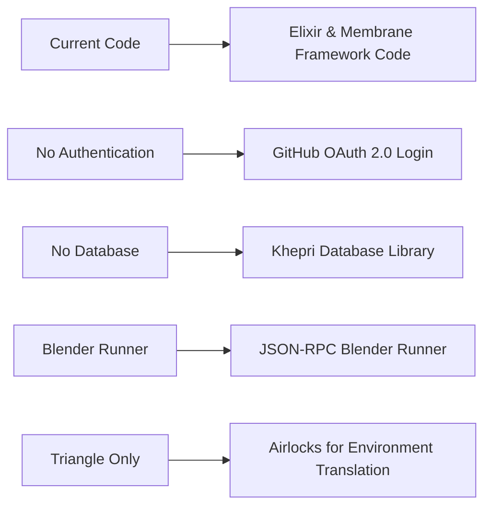

# Proposed: Transitioning to Membrane Framework Pipelines with JSON-RPC Blender Runner

## Metadata  

- **Status**: Proposed
- **Deciders**: V-Sekai  
- **Tags**: V-Sekai, Elixir, Membrane Framework, Multiplayer Blender, JSON-RPC

## Backdrop

The current solution for handling multiplayer Blender has its limitations when it comes to scalability and real-time performance. To address these issues, we propose a new approach that leverages Elixir and the Membrane Framework. This will involve rewriting the code and introducing a JSON-RPC Blender runner.

### Character Posing

In this new approach, character posing will be handled in real-time and shared across multiple clients. This means that any changes made to a 3D model by one user will be immediately reflected on all other connected clients. This feature will enhance the collaborative experience and allow users to interact with the same 3D models simultaneously.

### World Sharing

The state of the world, including objects, lighting, camera position, etc., will also be synchronized across all clients. This ensures that all users are experiencing the same environment, further enhancing the sense of immersion and collaboration.

### Procedural Generation

We will introduce procedural generation techniques to create unique and dynamic environments. These generated worlds will be shared across all clients, ensuring that each user's experience is not only immersive but also unique and engaging.

### Grease Pencil Sharing

Any drawings or annotations made using the Grease Pencil tool will be visible to all clients. This allows for collaborative sketching and planning, making it easier for teams to communicate their ideas visually.

### JSON-RPC Blender Runner

To facilitate efficient communication with Blender, we'll implement a JSON-RPC Blender runner. This will allow us to send commands to Blender and receive responses in a structured and standardized format. This feature will streamline the process of interacting with Blender, making it more efficient and user-friendly.

By implementing these features, we aim to improve the scalability and real-time performance of our multiplayer Blender solution. This will lead to a more immersive and collaborative experience for our users.

## The Challenge  

The main challenge is to translate the existing code into Elixir while maintaining the functionality and improving upon the limitations of the current system. This includes ensuring that the new code can handle larger volumes of users and provide real-time updates without lag or delay.

## Strategy  

This strategy leverages Elixir and the Membrane Framework's unique features, uses the Khepri database library for data management, implements GitHub login using OAuth 2.0 protocol for single sign-on, introduces a JSON-RPC Blender runner for improved communication with Blender, and focuses on the use of triangles (a polygon with 3 vertices) and "Airlocks" for environment translation.

Here are the key steps:

- **Codebase**: Transition from the current code to Elixir & Membrane Framework Code, tracked in a version control system.
  
- **Dependencies**: Declare and isolate dependencies explicitly, avoiding reliance on system-wide packages.

- **Config**: Store configuration (including GitHub OAuth 2.0 Login credentials) in the environment, not in the code.

- **Backing Services**: Replace in-memory data persistence with Khepri Database Library, attached as a backing service.

- **Build, Release, Run**: Strictly separate these stages, facilitated by the Elixir & Membrane Framework Code.

- **Processes**: Execute application as one or more stateless processes, storing needed state in the Khepri database.

- **Port Binding**: Export services via port binding, making the application self-contained.

- **Concurrency**: Scale out the application via the process model, allowing for handling increased load.

- **Disposability**: Aim for fast startup and graceful shutdown to maximize robustness.

- **Dev/Prod Parity**: Keep development, staging, and production environments as similar as possible.

- **Logs**: Treat logs as event streams, handled by the executing environment.

- **Admin Processes**: Run any needed one-off administrative tasks in an identical environment as the regular long-running processes of the app.

- **Blender Runner**: Implement a JSON-RPC Blender runner to facilitate efficient communication with Blender.

- **Triangle Only**: This principle ensures that only triangles (polygons with 3 vertices) are used in the graphical representation. This simplifies the rendering process and reduces computational complexity.

- **Airlocks**: Use airlocks to translate the remote environment to the local environment. This allows for seamless interaction between different parts of the system while maintaining isolation and security.

## The Upside  

By rewriting the code in Elixir, using the Membrane Framework, implementing the Khepri database library, introducing a JSON-RPC Blender runner, focusing on the use of triangles, and employing the "Airlocks" principles, we can expect improved scalability and real-time performance. This will allow for more users to use the system simultaneously without experiencing delays or lags. Additionally, the fault-tolerance feature of Elixir will ensure that the system remains operational even when errors occur.

## The Downside  

Rewriting the code will require time and resources. There may also be a learning curve for developers who are not familiar with Elixir, the Membrane Framework, the Khepri database library, JSON-RPC, the concept of using triangles in graphics, and "Airlocks".

## The Road Not Taken  

An alternative approach would have been to optimize the existing code instead of rewriting it. However, this would not have addressed the inherent limitations of the current system.

## The Infrequent Use Case  

In cases where the number of users is low and real-time updates are not critical, the current system may still be sufficient. However, as the user base grows and the demand for real-time updates increases, the need for a more scalable and efficient system becomes apparent.

## In Core and Done by Us?  

Yes, the rewriting of the code will indeed be done by us as we also maintain the backend services.

## Further Reading  

- [V-Sekai](https://v-sekai.org/)  
- [Elixir](https://elixir-lang.org/)
- [Membrane Framework](https://www.membraneframework.org/)
- [Khepri Database Library](https://hex.pm/packages/khepri)
- [JSON-RPC](https://www.jsonrpc.org/)

*This article is assisted by AI.*