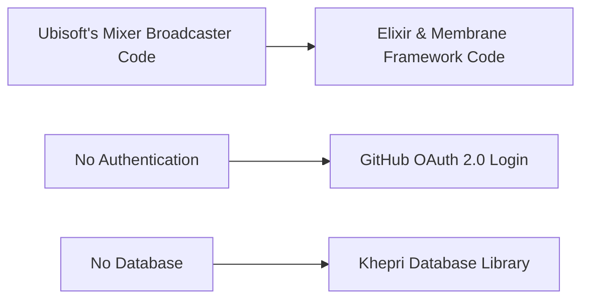

# Rejected: Rewriting Mixer Broadcaster Into Membrane Framework Pipelines

## Metadata  

- **Status**: Rejected
- **Deciders**: V-Sekai  
- **Tags**: V-Sekai, Elixir, Membrane Framework, Multiplayer Blender

## The Backdrop  

Ubisoft's mixer broadcaster code has been the only available solution for handling multiplayer Blender. However, it has its limitations when it comes to scalability and real-time performance. This proposal aims to rewrite the code using Elixir and the Membrane Framework.

## The Challenge  

The main challenge is to translate the existing code into Elixir while maintaining the functionality and improving upon the limitations of the current system. This includes ensuring that the new code can handle larger volumes of users and provide real-time updates without lag or delay.

## Strategy  

This strategy leverages Elixir and the Membrane Framework's unique features, uses the Khepri database library for data management, and implements GitHub login using OAuth 2.0 protocol for single sign-on.

Here are the key steps:

- **Codebase**: Transition from Ubisoft's Mixer Broadcaster Code to Elixir & Membrane Framework Code, tracked in a version control system.
  
- **Dependencies**: Declare and isolate dependencies explicitly, avoiding reliance on system-wide packages.

- **Config**: Store configuration (including GitHub OAuth 2.0 Login credentials) in the environment, not in the code.

- **Backing Services**: Replace in-memory data persistence with Khepri Database Library, attached as a backing service.

- **Build, Release, Run**: Strictly separate these stages, facilitated by the Elixir & Membrane Framework Code.

- **Processes**: Execute application as one or more stateless processes, storing needed state in the Khepri database.

- **Port Binding**: Export services via port binding, making the application self-contained.

- **Concurrency**: Scale out the application via the process model, allowing for handling increased load.

- **Disposability**: Aim for fast startup and graceful shutdown to maximize robustness.

- **Dev/Prod Parity**: Keep development, staging, and production environments as similar as possible.

- **Logs**: Treat logs as event streams, handled by the executing environment.

- **Admin Processes**: Run any needed one-off administrative tasks in an identical environment as the regular long-running processes of the app.

## The Upside  

By rewriting the code in Elixir, using the Membrane Framework, and implementing the Khepri database library, we can expect improved scalability and real-time performance. This will allow for more users to use the system simultaneously without experiencing delays or lags. Additionally, the fault-tolerance feature of Elixir will ensure that the system remains operational even when errors occur.

## The Downside  

Rewriting the code will require time and resources. There may also be a learning curve for developers who are not familiar with Elixir, the Membrane Framework, and the Khepri database library.

## The Road Not Taken  

An alternative approach would have been to optimize the existing code instead of rewriting it. However, this would not have addressed the inherent limitations of the current system.

## The Infrequent Use Case  

In cases where the number of users is low and real-time updates are not critical, the current system may still be sufficient. However, as the user base grows and the demand for real-time updates increases, the need for a more scalable and efficient system becomes apparent.

## In Core and Done by Us?  

Yes, the rewriting of the code will indeed be done by us as we also maintain the uro backend services.

## Further Reading  

- [V-Sekai](https://v-sekai.org/)  
- [Elixir](https://elixir-lang.org/)
- [Membrane Framework](https://www.membraneframework.org/)
- [Khepri Database Library](https://hex.pm/packages/khepri)

*This article is assisted by AI.*