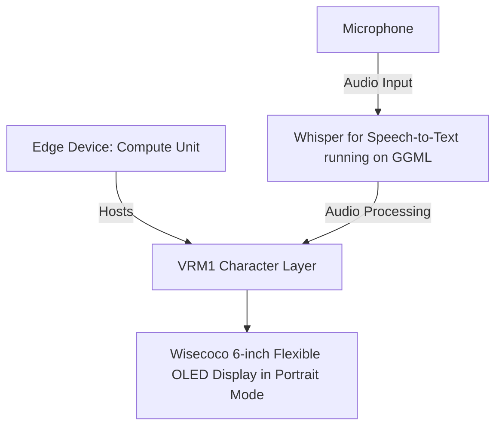

# Draft: Translation/Transcription Badge with GGML's Whisper

## Overview

The project aims to develop a translation/transcription badge using GGML's Whisper, a part of the GGML library that provides access to large language models (LLMs). The primary focus is on voice interactions.

## Key Features

- **Voice Interactions**: The system will prioritize voice interactions, leveraging GGML's Whisper capabilities to create a responsive AI. Python will not be used in this context.
- **Speech-to-Text Interface**: A speech-to-text interface will be incorporated to process voice inputs effectively.
- **Direct Connection to Compute Module**: The display, set in portrait mode, will connect directly to the compute module, a standard Linux amd64 computer, eliminating the need for embedded software development.
- **Flexible OLED Display**: The system will utilize a 6-inch flexible OLED display from Wisecoco with a resolution of 2880\*1440 at 60Hz refresh rate.
- **No Holograph Displays**: The design will be streamlined and efficient, excluding holograph displays.

## Potential Challenges

The project's complexity and the expertise required in areas such as GGML, the Godot engine, and AI development pose significant challenges.

## Alternatives Not Considered

We have decided against integrating Python with GGML and using a pre-existing AI framework instead of developing one from scratch.

## Target Audience

The project may not be suitable for individuals without familiarity with GGML or a background in AI development.

## Development Strategy

The project will be developed in-house, utilizing our expertise in AI and game development.

## Further Reading

For more information, please refer to these resources:

- [V-Sekai](https://v-sekai.org/)
- [GGML on GitHub](https://github.com/georgi-gerganov/ggml)
- [Whisper JAX on GitHub](https://github.com/sanchit-gandhi/whisper-jax)
- [Twitter inspiration](https://twitter.com/jav6868/status/1698260873352212662?s=20)
- [wisecoco 6 inch 2K Flexible OLED Display IPS 2880 \* 1440 Flexible Screen Curved Bendable Screen](https://www.amazon.ca/wisecoco-Flexible-Display-Screen-Bendable/dp/B0C7YY16Z5)

## System Diagram

## System Diagram Explanation:

### 1. Edge Device: Compute Unit (A)

This unit is a standard Linux amd64 computer that hosts the VRM1 Character Layer (B).

### 2. Whisper for Speech-to-Text module (C)

This module, running on GGML, captures audio input from the Microphone (E) and converts it into text.

### 3. VRM1 Character Layer (B)

The processed data from the Whisper module animates a virtual character in this layer. The character can be in speaking or idle mode.

### 4. Wisecoco 6-inch Flexible OLED Display in Portrait Mode (D)

The resulting texts are displayed on this screen.

> **Note:** Currently, the system only supports speaking and idle states. Other modes are not available.

The choice of portrait mode for the display aligns with the specific needs and constraints of the project. As the project heavily relies on text-based interactions, specifically transcriptions, portrait mode allows more lines of text to be visible at once, thereby improving the user experience.

The system utilizes a 6-inch flexible OLED display from Wisecoco. Portrait mode is more space-efficient in such scenarios, taking up less horizontal space while still providing ample vertical space for text display.

Given that the primary focus of the project is voice interactions, the display mode should ideally support easy reading of transcriptions. Portrait mode, with its vertical orientation, is more suited to this task as it mimics the natural top-to-bottom reading flow.

According to the system diagram, the processed data from the Whisper for Speech-to-Text module running on GGML is used to animate a virtual character and display the resulting texts. These texts are likely to be dialog or conversation-based, and portrait mode would allow for a more coherent and continuous display of these text blocks.
