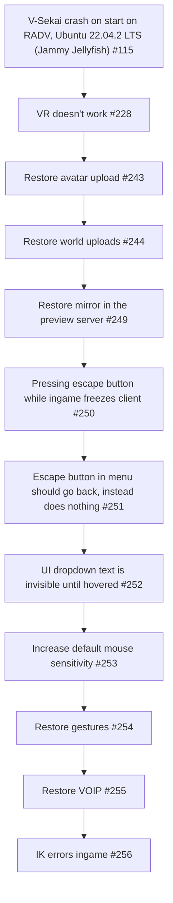

# Proposed: Challenges that need to be addressed in V-Sekai

## Metadata

- **Status:** Proposed
- **Deciders:** V-Sekai
- **Tags:** V-Sekai

## The Backdrop

In our quest to expand our community, we are faced with several challenges that need to be addressed.

## The Challenge

Our game has been QA Engineered by Facade, which was a great help. However, there are still issues that need to be resolved.

## The Strategy

We have identified several areas of concern and have charted them in the following flow diagram:

## The Upside

Addressing these issues will significantly improve the user experience, making our game more enjoyable and accessible. This could lead to an increase in our user base and community engagement.

## The Downside

The process of resolving these issues may require significant time and resources. It might also involve some trial and error, which could potentially introduce new bugs or problems.

## The Road Not Taken

Ignoring these issues is not an option as it would negatively impact the user experience and could hinder the growth of our community.

## The Infrequent Use Case

While some of these issues might only affect a small number of users or occur under specific circumstances, it's important to address them to ensure a smooth and enjoyable experience for all users.

## In Core and Done by Us?

Yes, these issues are core to the functionality of our game and should be addressed by our team.

## Further Reading

- [V-Sekai](https://v-sekai.org/)
- This article is assisted by AI.
