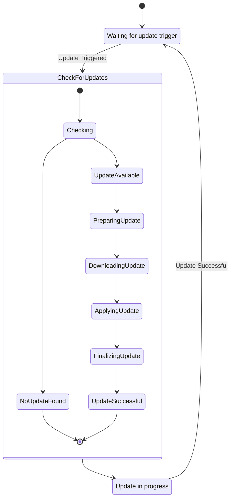

# Proposed: Headless Launcher Backend with Elixir and Server-Side CockroachDB

## Metadata

- **Status:** Proposed
- **Deciders:** V-Sekai Team
- **Tags:** `headless`, `backend`, `launcher`, `updater`

## Backdrop

Introduce a headless backend launcher to automate game updates for enhanced gaming experience.

## Challenge

Build an updater that is simple yet robust, handling automated game updates in the background.

## Strategy



Use Elixir for concurrent services and CockroachDB on the server for data management:

1. **Headless CLI**

   - Implement desync for data synchronization.
   - Detail how desync will be integrated into the service and GUI.

```bash
vsekai --help
vsekai --version
vsekai auth login --client_id your_client_id --client_secret your_client_secret --redirect_uri your_redirect_uri --scope user:email
vsekai config set --key your_key --value your_value
vsekai config get --key your_key
vsekai log view
vsekai auth token
vsekai auth logout
vsekai portal check-status
vsekai portal launch
vsekai portal restart
vsekai portal close
vsekai system update
vsekai system check
vsekai version upload --file your_version_file
vsekai version list
vsekai version download --version your_version_number
vsekai version delete --version your_version_number
vsekai profile switch --profile_name your_profile_name
vsekai sync start --source your_source_directory --destination your_destination_directory
vsekai sync pause
vsekai sync resume
vsekai sync check-status
vsekai sync extract --index your_index_file
vsekai sync verify --store your_store_location
vsekai sync list-chunks --index your_index_file
vsekai sync make --blob your_blob --chunk_size min:avg:max
vsekai sync mount-index --index your_index_file --mountpoint your_mountpoint
vsekai sync tar --catar your_catar_file
vsekai sync untar --catar your_catar_file
vsekai sync prune --store your_store_location
```

2. **Updater Online Service:**

   - Create a lightweight updater service.
   - Use Elixir for web requests handling.
   - Utilize server-side CockroachDB for persistence.
   - Integrate desync protocol in the Service.
   - Include error handling strategy for failed updates or data synchronization issues.

3. **GUI Launcher Creation:**

   - Design an intuitive Godot Engine GUI launcher.
   - Integrate desync protocol in the GUI.
   - Detail the basic visual setup with V-Sekai branding.

4. **Game Setup Efforts:**
   - Develop a basic visual setup with V-Sekai branding.
   - Include a plan for testing each component to ensure functionality.
   - Address security concerns, including user data protection and secure updates.
   - Discuss scalability potential with increasing users or larger game updates.

## Upside

This system promotes seamless gaming with high performance and reliability from Elixir and CockroachDB.

## Downside

Technology integration may lead to complex issues and compatibility challenges.

## Road Not Taken

External updaters and manual patches were dismissed for their demanding nature.

## Infrequent Use Case

Design will allow manual update initiation for situations like limited bandwidth.

## Core and Done by Us?

The V-Sekai team will develop and maintain this launcher backend. A detailed maintenance plan will be provided.

## Documentation

A comprehensive documentation will be created for understanding the system and onboarding new team members.

## Further Reading

- [**V-Sekai GitHub**](https://github.com/v-sekai) - Our efforts in VR using Godot Engine.
- [**V-Sekai Game Repo**](https://github.com/v-sekai/v-sekai-game) - Our open-source VR and social experiences project.
- [**Desync**](https://github.com/folbricht/desync) - Alternative casync implementation.
