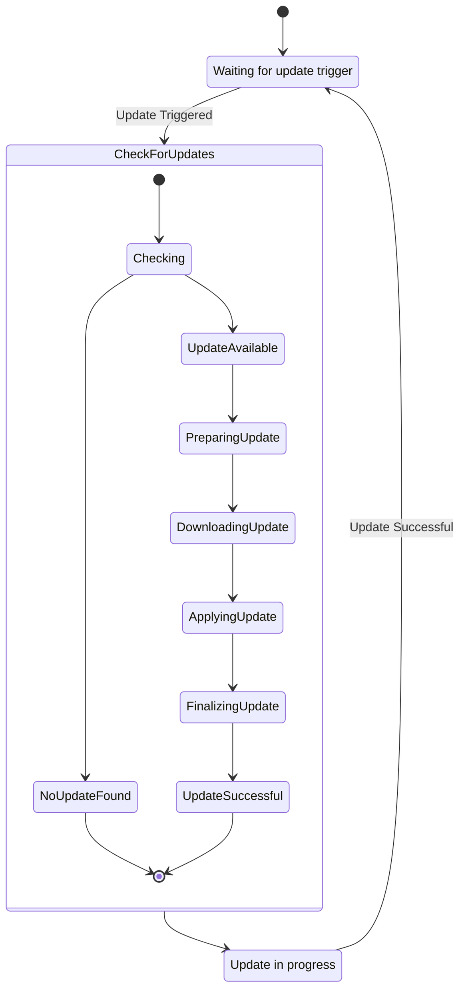

### Proposed: Headless Launcher Backend with Elixir and Server-Side SQLite

#### Metadata

- **Status:** Proposed
- **Deciders:** V-Sekai Team
- **Tags:** `headless`, `backend`, `launcher`, `updater`

#### Backdrop

Introduce a headless backend launcher to automate game updates for enhanced gaming experience.

#### Challenge

Build an updater that is simple yet robust, handling automated game updates in the background.

#### Strategy

Use Elixir for concurrent services and SQLite on the server for data management:

1. **Headless CLI**

   - Implement desync for data synchronization.

2. **Updater Online Service:**

   - Create a lightweight updater service.
   - Use Elixir for web requests handling.
   - Utilize server-side SQLite for persistence.
   - Integrate desync protocol in the Service.

3. **GUI Launcher Creation:**

   - Design an intuitive Godot Engine GUI launcher.
   - Integrate desync protocol in the GUI.

4. **Game Setup Efforts:**
   - Develop a basic visual setup with V-Sekai branding.

#### Upside

This system promotes seamless gaming with high performance and reliability from Elixir and SQLite.

#### Downside

Technology integration may lead to complex issues and compatibility challenges.

#### Road Not Taken

External updaters and manual patches were dismissed for their demanding nature.

#### Infrequent Use Case

Design will allow manual update initiation for situations like limited bandwidth.

#### Core and Done by Us?

The V-Sekai team will develop and maintain this launcher backend.

#### Further Reading

- [**V-Sekai GitHub**](https://github.com/v-sekai) - Our efforts in VR using Godot Engine.
- [**V-Sekai Game Repo**](https://github.com/v-sekai/v-sekai-game) - Our open-source VR and social experiences project.
- [**Desync**](https://github.com/folbricht/desync) - Alternative casync implementation.
