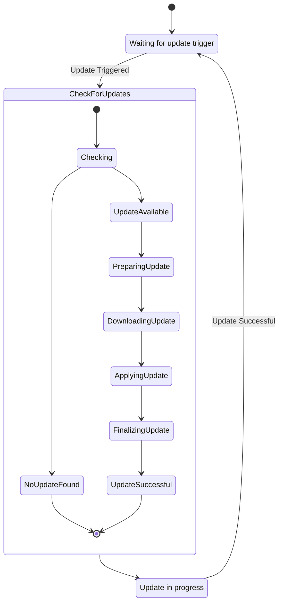

# Proposed: Headless Launcher Backend with Elixir and Server-Side CockroachDB

## Metadata

- **Status:** Proposed
- **Deciders:** V-Sekai Team
- **Tags:** `headless`, `backend`, `launcher`, `updater`

## Backdrop

Introduce a headless backend launcher to automate game updates for enhanced gaming experience.

## Challenge

Build an updater that is simple yet robust, handling automated game updates in the background.

## Strategy



Use Elixir for concurrent services and CockroachDB on the server for data management:

1. **Headless CLI**

   - Implement desync for data synchronization.
   - Detail how desync will be integrated into the service and GUI.

```bash
# Display help information
vsekai --help

# Display version information
vsekai --version

# Switch to a different mode. Modes allow different operations for the software.
vsekai mode switch --mode_name stable

# Check the current mode.
vsekai mode current

# List all available modes.
vsekai mode list

# Always updates according to semantic versioning to the mode.
./headless-vsekai-v0.1.0.exe --update C:/v-sekai/launcher
./headless-vsekai-v0.1.1.exe --update C:/v-sekai/launcher
./headless-vsekai-v0.2.0.exe --update C:/v-sekai/launcher

# Pseudo code for update process
check_launcher_folder()
validate_manifest_file_and_version()
ensure_correct_files_for_update()
download_to_temp()
delete_old_and_move_over()
setup_registry_values()
```

2. **Updater Online Service:**

   - Create a lightweight updater service.
   - Use Elixir for web requests handling.
   - Utilize server-side CockroachDB for persistence.
   - Integrate desync protocol in the Service.
   - Include error handling strategy for failed updates or data synchronization issues.

3. **GUI Launcher Creation:**

   - Design an intuitive Godot Engine GUI launcher.
   - Integrate desync protocol in the GUI.
   - Detail the basic visual setup with V-Sekai branding.

4. **Game Setup Efforts:**
   - Develop a basic visual setup with V-Sekai branding.
   - Include a plan for testing each component to ensure functionality.
   - Address security concerns, including user data protection and secure updates.
   - Discuss scalability potential with increasing users or larger game updates.

### Data model

CockroachDB is a distributed SQL database that is designed for cloud services. It supports JSONB data type which can be used to store array or map data.

To support all the features and normalize 6NF the tables, we need to create several tables:

1. **Modes Table**

```elixir
defmodule MyApp.Mode do
  use Ecto.Schema

  schema "modes" do
    field :id, Ecto.UUID, autogenerate: true, primary_key: true
    field :name, :string
    field :is_current, :boolean, default: false
    field :valid_from, :utc_datetime
    field :valid_to, :utc_datetime

    timestamps()
  end
end
```

2. **Version Table**

```elixir
defmodule MyApp.Version do
  use Ecto.Schema

  schema "versions" do
    field :id, Ecto.UUID, autogenerate: true, primary_key: true
    field :version_number, :string
    field :executable_path, :string
    field :valid_from, :utc_datetime
    field :valid_to, :utc_datetime

    timestamps()
  end
end
```

3. **Update Process Table**

```elixir
defmodule MyApp.UpdateProcess do
  use Ecto.Schema

  schema "update_processes" do
    field :id, Ecto.UUID, autogenerate: true, primary_key: true
    field :launcher_folder, :string
    field :manifest_file_and_version, :string
    field :files_for_update, {:array, :string}
    field :temp_download_path, :string
    field :old_files_path, {:array, :string}
    field :registry_values, {:map, :string}
    field :valid_from, :utc_datetime
    field :valid_to, :utc_datetime

    timestamps()
  end
end
```

In these schemas, `valid_from` and `valid_to` fields are used to track the period during which a particular record is valid. This allows you to keep a history of changes over time.

The `{:array, :string}` and `{:map, :string}` data types are used for `files_for_update`, `old_files_path`, and `registry_values` to store array or map data.

## Upside

This system promotes seamless gaming with high performance and reliability from Elixir and CockroachDB.

## Downside

Technology integration may lead to complex issues and compatibility challenges.

## Road Not Taken

External updaters and manual patches were dismissed for their demanding nature.

## Infrequent Use Case

Design will allow manual update initiation for situations like limited bandwidth.

## Core and Done by Us?

The V-Sekai team will develop and maintain this launcher backend. A detailed maintenance plan will be provided.

## Documentation

A comprehensive documentation will be created for understanding the system and onboarding new team members.

## Further Reading

- [**V-Sekai GitHub**](https://github.com/v-sekai) - Our efforts in VR using Godot Engine.
- [**V-Sekai Game Repo**](https://github.com/v-sekai/v-sekai-game) - Our open-source VR and social experiences project.
- [**Desync**](https://github.com/folbricht/desync) - Alternative casync implementation.
