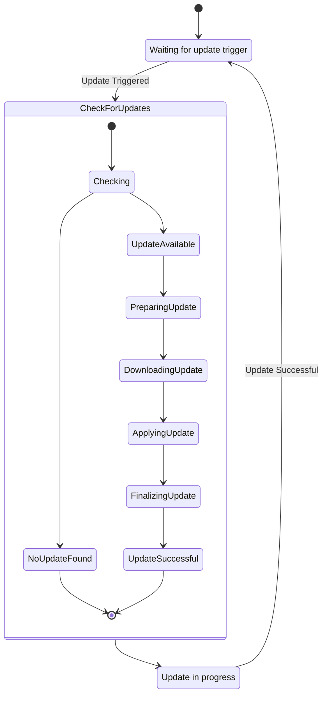

# Proposed: Headless Launcher Backend with Elixir and Server-Side CockroachDB

## Metadata

- **Status:** Proposed
- **Deciders:** V-Sekai Team
- **Tags:** `headless`, `backend`, `launcher`, `updater`

## Backdrop

Introduce a headless backend launcher to automate game updates for enhanced gaming experience.

## Challenge

Build an updater that is simple yet robust, handling automated game updates in the background.

## Strategy

The strategy for this proposal is to develop a headless backend launcher using Elixir and CockroachDB. The main components of the system will be:

The Headless CLI will implement `desync` for data synchronization and provide commands for displaying help information, version information, switching modes, checking current mode, listing all available modes, and updating according to semantic versioning.

The Updater Online Service will be a lightweight service that uses Elixir for handling web requests and CockroachDB for persistence. It will integrate the `desync` protocol and include error handling strategies for failed updates or data synchronization issues.

The GUI Launcher will be designed using the Godot Engine and will also integrate the `desync` protocol. It will feature a basic visual setup with V-Sekai branding.

The Game Sample will involve developing a basic visual sample with V-Sekai branding, planning for testing each component to ensure functionality, addressing security concerns including user data protection and secure updates, and discussing scalability potential with increasing users or larger game updates.

The data model for this system will be in 6NF database normalization. Each table will have its own schema module representing different aspects of the application such as modes, versions, and update processes.

## Upside

This system promotes seamless gaming with high performance and reliability from Elixir and CockroachDB.

## Downside

Technology integration may lead to complex issues and compatibility challenges.

## Road Not Taken

External updaters and manual patches were dismissed for their demanding nature.

## Infrequent Use Case

Design will allow manual update initiation for situations like limited bandwidth.

## Core and Done by Us?

The V-Sekai team will develop and maintain this launcher backend. A detailed maintenance plan will be provided.

## Documentation

A comprehensive documentation will be created for understanding the system and onboarding new team members.

## Further Reading

- [**V-Sekai GitHub**](https://github.com/v-sekai) - Our efforts in VR using Godot Engine.
- [**V-Sekai Game Repo**](https://github.com/v-sekai/v-sekai-game) - Our open-source VR and social experiences project.
- [**Desync**](https://github.com/folbricht/desync) - Alternative casync implementation.

## Code Snippets



Use Elixir for concurrent services and CockroachDB on the server for data management:

1. **Headless CLI**

   - Implement desync for data synchronization.
   - Detail how desync will be integrated into the service and GUI.

```bash
# Display help information
vsekai --help

# Display version information
vsekai --version

# Switch to a different mode. Modes allow different operations for the software.
vsekai mode switch --mode_name stable

# Check the current mode.
vsekai mode current

# List all available modes.
vsekai mode list

# Always updates according to semantic versioning to the mode.
./headless-vsekai-v0.1.0.exe --update C:/v-sekai/launcher
./headless-vsekai-v0.1.1.exe --update C:/v-sekai/launcher
./headless-vsekai-v0.2.0.exe --update C:/v-sekai/launcher

# Pseudo code for update process
check_launcher_folder()
validate_manifest_file_and_version()
ensure_correct_files_for_update()
download_to_temp()
delete_old_and_move_over()
setup_registry_values()
```

2. **Updater Online Service:**

   - Create a lightweight updater service.
   - Use Elixir for web requests handling.
   - Utilize server-side CockroachDB for persistence.
   - Integrate desync protocol in the Service.
   - Include error handling strategy for failed updates or data synchronization issues.

3. **GUI Launcher Creation:**

   - Design an intuitive Godot Engine GUI launcher.
   - Integrate desync protocol in the GUI.
   - Detail the basic visual setup with V-Sekai branding.

4. **Game Setup Efforts:**
   - Develop a basic visual setup with V-Sekai branding.
   - Include a plan for testing each component to ensure functionality.
   - Address security concerns, including user data protection and secure updates.
   - Discuss scalability potential with increasing users or larger game updates.

### Data model in 6NF database normalization

1. **Modes Table**

```elixir
defmodule VSekaiNebula.Mode do
  @moduledoc """
  A schema module representing the modes in the application.
  Each mode has a unique ID and a name.
  """

  use Ecto.Schema

  schema "modes" do
    field :name, :string
    field :id, Ecto.UUID, autogenerate: true, primary_key: true

    has_one :validity, VSekaiNebula.ModeValidity

    timestamps()
  end

  # TODO changeset/2
end
```

**ModeValidity Table**

```elixir
defmodule VSekaiNebula.ModeValidity do
  @moduledoc """
  A schema module representing the validity of each mode.
  It includes the valid_from and valid_to fields to specify the validity period of a mode.
  """

  use Ecto.Schema

  schema "mode_validities" do
    field :valid_from, :utc_datetime
    field :valid_to, :utc_datetime
    field :id, Ecto.UUID, autogenerate: true, primary_key: true

    belongs_to :mode, VSekaiNebula.Mode

    timestamps()
  end

  # TODO changeset/2
end
```

**Product Table**

```elixir
defmodule VSekaiNebula.Product do
  @moduledoc """
  A schema module representing the products in the application.
  Each product has a unique ID and a name.
  """

  use Ecto.Schema

  schema "products" do
    field :name, :string
    field :id, Ecto.UUID, autogenerate: true, primary_key: true

    has_many :versions, VSekaiNebula.Version
    has_one :validity, VSekaiNebula.ProductValidity

    timestamps()
  end

  # TODO changeset/2
end
```

**ProductValidity Table**

```elixir
defmodule VSekaiNebula.ProductValidity do
  @moduledoc """
  A schema module representing the validity of each product.
  It includes the valid_from and valid_to fields to specify the validity period of a product.
  """

  use Ecto.Schema

  schema "product_validities" do
    field :valid_from, :utc_datetime
    field :valid_to, :utc_datetime
    field :id, Ecto.UUID, autogenerate: true, primary_key: true

    belongs_to :product, VSekaiNebula.Product

    timestamps()
  end

  # TODO changeset/2
end
```

**Version Table**

```elixir
defmodule VSekaiNebula.Version do
  @moduledoc """
  A schema module representing the versions of a product.
  Each version has a major_version, minor_version, patch_version, tag, executable_path, and a unique ID.
  """

  use Ecto.Schema

  schema "versions" do
    field :major_version, :integer
    field :minor_version, :integer
    field :patch_version, :integer
    field :tag, :string
    field :executable_path, :string
    field :id, Ecto.UUID, autogenerate: true, primary_key: true

    belongs_to :product, VSekaiNebula.Product

    has_one :validity, VSekaiNebula.VersionValidity

    timestamps()
  end

  # TODO changeset/2
end
```

**VersionValidity Table**

```elixir
defmodule VSekaiNebula.VersionValidity do
  @moduledoc """
  A schema module representing the validity of each version.
  It includes the valid_from and valid_to fields to specify the validity period of a version.
  """

  use Ecto.Schema

  schema "version_validities" do
    field :valid_from, :utc_datetime
    field :valid_to, :utc_datetime
    field :id, Ecto.UUID, autogenerate: true, primary_key: true

    belongs_to :version, VSekaiNebula.Version

    timestamps()
  end

  # TODO changeset/2
end
```

3. **Update Process Table**

```elixir
defmodule VSekaiNebula.UpdateProcess do
  @moduledoc """
  A schema module representing the update process in the application.
  Each update process has a launcher_folder, manifest_file_and_version, files_for_update, registry_values, and a unique ID.
  """

  use Ecto.Schema

  schema "update_processes" do
    field :manifest_file_and_version, :string
    field :files_for_update, {:array, :string}
    field :registry_values, {:map, :string}
    field :id, Ecto.UUID, autogenerate: true, primary_key: true

    has_one :update_process_validity, VSekaiNebula.UpdateProcessValidity

    timestamps()
  end

  # TODO changeset/2
end
```

**UpdateProcessValidity Table**

```elixir
defmodule VSekaiNebula.UpdateProcessValidity do
  @moduledoc """
  A schema module representing the validity of each update process.
  It includes the valid_from and valid_to fields to specify the validity period of an update process.
  """

  use Ecto.Schema

  schema "update_process_validities" do
    field :valid_from, :utc_datetime
    field :valid_to, :utc_datetime
    field :id, Ecto.UUID, autogenerate: true, primary_key: true

    belongs_to :update_process, VSekaiNebula.UpdateProcess

    timestamps()
  end

  # TODO changeset/2
end
```

**Casync_caches Table**

```elixir
defmodule VSekaiNebula.CasyncCache do
  use Ecto.Schema

  schema "casync_caches" do
    field :path, :string
    field :id, Ecto.UUID, autogenerate: true, primary_key: true

    belongs_to :update_process, VSekaiNebula.UpdateProcess

    timestamps()
  end

  def changeset(struct, params \\ %{}) do
    struct
    |> Ecto.Changeset.cast(params, [:path])
    |> Ecto.Changeset.validate_required([:path])
    |> Ecto.Changeset.foreign_key_constraint(:update_process_id)
  end
end
```

**CasyncCacheHistory Table**

```elixir
defmodule VSekaiNebula.CasyncCacheHistory do
  @moduledoc """
  A schema module representing the historical states of the casync cache folder in the application.
  Each record has a unique ID, a path, an associated update process, and the time period during which this state was valid.
  """

  use Ecto.Schema

  schema "casync_cache_histories" do
    field :path, :string
    field :valid_from, :utc_datetime
    field :valid_to, :utc_datetime
    field :id, Ecto.UUID, autogenerate: true, primary_key: true

    belongs_to :update_process, VSekaiNebula.UpdateProcess
    belongs_to :casync_cache, VSekaiNebula.CasyncCache

    timestamps()
  end

  # TODO changeset/2
end
```
