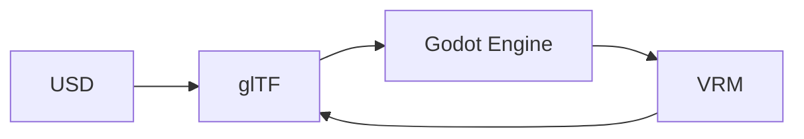

# Proposed: Workflows for 3D Model Conversion

## The Context

In the realm of 3D modeling and animation, there are numerous file formats each with their own unique features and capabilities. However, not all software can support every format, leading to a need for conversion tools.

## The Problem Statement

The challenge lies in creating a tool that can convert between different 3D model formats, specifically from glTF to FBX, while maintaining the integrity of the original model.

## Describe how your proposal will work with code, pseudo-code, mock-ups, or diagrams

We propose to develop a workflow for 3D model conversion using the Elixir Membrane Framework.

The primary function of this tool would be to take a glTF file as input and export it as an FBX file. This tool could also potentially support other formats such as USD, Godot Engine tscn, and VRM.

Additionally, we propose a feature where the tool can take a post and return a result. This could be useful for batch processing or automated tasks.

To make these services accessible, we plan to expose them via a Tailscale funnel.

For many of the flows, we can use USD to glTF, then glTF to Godot Engine, and finally Godot Engine to VRM and back. This approach allows us to leverage existing conversion libraries and tools, reducing the amount of custom code we need to write.

## The Benefits

This tool would greatly simplify the process of converting 3D models between different formats, saving time and reducing potential errors.

## The Downsides

There may be some loss of data or quality during the conversion process, depending on the complexity of the model and the capabilities of the target format.

## The Road Not Taken

Alternative solutions could involve using existing conversion tools or plugins, but these may not offer the same level of control or flexibility as a custom-built tool.

## The Infrequent Use Case

While the primary use case is for converting glTF to FBX, the tool could also be used for other less common conversions.

## In Core and Done by Us

This tool would be developed in-house by the V-Sekai development team.

## Status

Status: Proposed <!-- Draft | Proposed | Rejected | Accepted | Deprecated | Superseded by -->

## Decision Makers

- V-Sekai development team

## Tags

- V-Sekai

## Further Reading

1. [V-Sekai · GitHub](https://github.com/v-sekai) - Official GitHub account for the V-Sekai development community focusing on social VR functionality for the Godot Engine.
2. [V-Sekai/v-sekai-game](https://github.com/v-sekai/v-sekai-game) is the GitHub page for the V-Sekai open-source project, which brings social VR/VRSNS/metaverse components to the Godot Engine.

AI assistant Aria assisted with this article.
