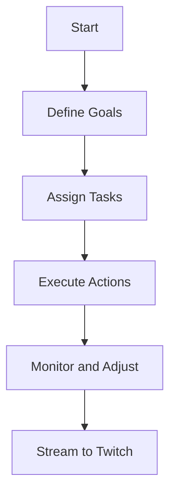
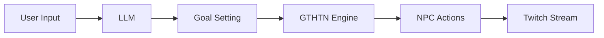

# Proposal: RPG Town in V-Sekai

## The Context

Researchers have been studying emergent AI behaviors in sandbox environments inspired by games like The Sims. This proposal aims to leverage these insights to enhance the V-Sekai game, which features 25 NPCs running goal-task hierarchical task network (GT-HTN).

## The Problem Statement

The challenge is to create a dynamic and engaging environment where NPCs exhibit complex behaviors that can be streamed 24/7. The goal is to make the game interesting enough for Twitch streaming while ensuring the NPCs' actions are meaningful and not just random clicks.

## Describe How Your Proposal Will Work

For HTN implementation, we will study the GOAP framework from Vinicius Gerevini's GitHub and define tasks and goals for NPCs using predicate, subject-object triplet variables, or method calls. Networking and traffic simulation will involve implementing network traffic tests to ensure smooth operation and using tools like Microsoft's GraphRAG for generating predicate and subject objects. For LLM integration, we will integrate Large Language Models (LLMs) to set goals for NPCs based on Twitch chat summaries, using LLMs to help plan but not directly control NPC actions.

### Mock-Ups and Diagrams

**NPC Interaction Flow**:

**System Architecture**:

## The Benefits

Creating an interactive and dynamic environment suitable for Twitch streaming will result in engaging content. It allows for complex and unpredictable NPC interactions, fostering emergent behaviors. Additionally, it engages the community by summarizing Twitch chat to set NPC goals.

## The Downsides

Implementing and maintaining such a system can be challenging due to its complexity. It also requires significant computational resources for real-time processing and streaming.

## The Road Not Taken

Manually setting NPC goals and actions would be less dynamic and engaging. Using simpler AI models may not exhibit complex behaviors.

## The Infrequent Use Case

Running the game without Twitch integration, focusing solely on NPC interactions, represents an infrequent use case.

## In Core and Done by Us

We will implement the GOAP framework within the V-Sekai game and integrate LLMs for goal setting based on community input.

## Status

Status: Proposed <!-- Draft | Proposed | Rejected | Accepted | Deprecated | Superseded by -->

## Decision Makers

The decision makers for this proposal are the V-Sekai development team.

## Tags

V-Sekai

## Further Reading

For more information, you can visit the [V-Sekai GitHub account](https://github.com/v-sekai), which focuses on social VR functionality for the Godot Engine. You can also check out the [V-Sekai open-source project](https://github.com/v-sekai/v-sekai-game), which brings social VR/VRSNS/metaverse components to the Godot Engine.

AI assistant Aria assisted with this article.
