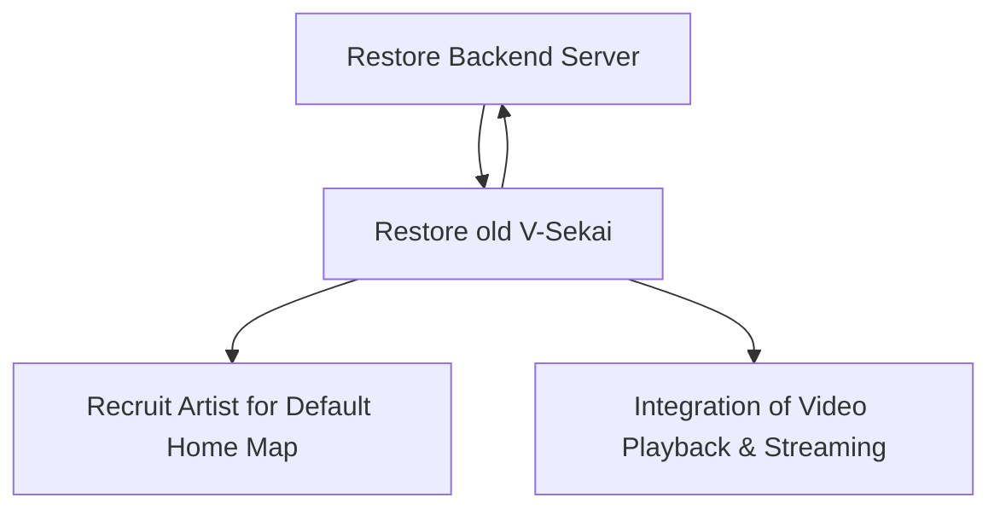

# Draft: Plan November 2024

## The Context

## The Problem Statement

## Design

## The Benefits

## The Downsides

## The Road Not Taken

## The Infrequent Use Case

## In Core and Done by Us

## Status

Status: Draft <!-- Draft | Proposed | Rejected | Accepted | Deprecated | Superseded by -->

## Decision Makers

- V-Sekai development team

## Tags

- V-Sekai, 20241102-plan-november-2024

## Further Reading

1. [V-Sekai · GitHub](https://github.com/v-sekai) - Official GitHub account for the V-Sekai development community focusing on social VR functionality for the Godot Engine.
2. [V-Sekai/v-sekai-game](https://github.com/v-sekai/v-sekai-game) is the GitHub page for the V-Sekai open-source project, which brings social VR/VRSNS/metaverse components to the Godot Engine.

AI assistant Aria assisted with this article.
