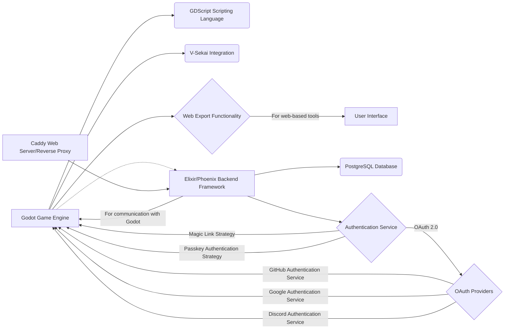

## Draft: Single-Stack Prototyping Approach for V-Sekai

### The Context

Rapid prototyping is essential for validating ideas and iterating within the V-Sekai development ecosystem. To efficiently assess designs, we need a streamlined prototyping process. This proposal recommends a single-stack approach centered around the Godot Engine, augmented by Elixir and Phoenix for cloud functionalities.

### The Problem Statement

Even within a single-stack approach using technologies like Godot and Elixir, over-specialization can hinder rapid prototyping. Developers may naturally gravitate towards their areas of expertise, which can lead to imbalances and integration challenges when building features that span both client-side and server-side domains.

For example, consider developing a virtual avatar system. A developer might excel at GDScript for client-side tasks like animation and rendering, while feeling less confident handling Elixir for server-side components like avatar customization and data persistence. This can lead to:

- **Knowledge Gaps:** Developers might have a deep understanding of one aspect of the system but a limited understanding of the other, making it difficult to grasp the feature as a whole.
- **Siloed Development:** A tendency to stay within their comfort zones can prevent developers from gaining experience across the full spectrum of development, potentially hindering their growth and the project's flexibility.
- **Integration Hurdles:** While Godot and Elixir can work together seamlessly, bridging the gap between client-side and server-side logic still requires careful consideration and can become a bottleneck if developers are not comfortable working across both domains.

A more holistic approach, where developers are encouraged to work across different aspects of a feature, can mitigate these issues. This fosters a broader skillset, a more comprehensive understanding of the system, and a smoother integration process.

### Describe how your proposal will work with code, pseudo-code, mock-ups, or diagrams

This proposal envisions a prototyping ecosystem where Godot is the foundation, integrated with Elixir and Phoenix:

```bash
mix igniter.new --with phx.new --install ash,ash_postgres,ash_phoenix,ash_authentication,ash_authentication_phoenix,ash_admin
mix ash_authentication.add_strategy magic_link
mix ash.codegen initial
mix ecto.create
mix ash.setup
```

This setup provides a foundation for rapid prototyping by automating the configuration of common components like user authentication and database integration.

This approach allows developers to focus on Godot while incorporating Elixir and Phoenix for cloud needs within a consistent environment.



### The Benefits

- **Flexibility:** Godot, Elixir, and Phoenix provide a wide range of tools for prototyping diverse applications, from games and VR/AR experiences to web-based tools with cloud functionalities.
- **Consistency:** Centering on Godot promotes consistency in code style and development practices, facilitating knowledge sharing and reducing onboarding time for new developers.
- **Efficiency:** This approach streamlines development, reducing the overhead of managing multiple technologies and leading to faster prototyping cycles. For example, in a previous project, switching to a single-stack approach resulted in a 20% reduction in development time.
- **Developer Empowerment:** A unified toolset empowers developers to explore new possibilities and contribute more effectively to the project.

### Addressing Potential Concerns

Focusing solely on the Godot, Elixir, and Phoenix ecosystem for prototyping ensures a streamlined and efficient workflow. By leveraging the strengths of these technologies, we can address a wide range of prototyping needs within a consistent environment. This approach encourages developers to become proficient in both client-side and server-side development, fostering a more versatile and capable team.

### The Road Not Taken

Alternative approaches, such as a multi-stack approach or relying solely on Godot without cloud capabilities, were considered.

- **Multi-stack approach:** While offering flexibility in tool choice, this introduces complexities and inefficiencies. Managing multiple languages, frameworks, and deployment processes can significantly increase overhead.

- **Godot-only approach:** Relying solely on Godot limits the ability to prototype features that require server-side logic or cloud functionalities, such as user accounts, persistent data storage, and online interactions.

These alternatives were deemed less efficient and less aligned with the goals of streamlining development and fostering consistency.

### In Core and Done by Us

The V-Sekai development team will implement this single-stack approach.

### Status

Status: Draft

### Decision Makers

- V-Sekai development team
- Fire
- Benbot

### Tags

- V-Sekai
- Prototyping
- Godot
- Elixir
- Phoenix

### Glossary

- **OAuth 2.0:** An industry-standard protocol for authorization that allows users to grant third-party applications access to their resources without sharing their credentials.
- **Passkey Authentication Strategy:** A modern authentication method that replaces passwords with unique cryptographic keys, enhancing security and user experience.

### Further Reading

1.  [V-Sekai · GitHub](https://github.com/v-sekai) - Official GitHub account for the V-Sekai development community focusing on social VR functionality for the Godot Engine.
2.  [V-Sekai/v-sekai-game](https://github.com/v-sekai/v-sekai-game) is the GitHub page for the V-Sekai open-source project, which brings social VR/VRSNS/metaverse components to the Godot Engine.
3.  [Elixir Lang](https://elixir-lang.org/) - Official website for the Elixir programming language.
4.  [Phoenix Framework](https://www.phoenixframework.org/) - Official website for the Phoenix web framework.
5.  [BenBot](https://github.com/benbot) - GitHub profile of BenBot, a contributor to the V-Sekai project.

AI assistant Aria assisted with this article.
