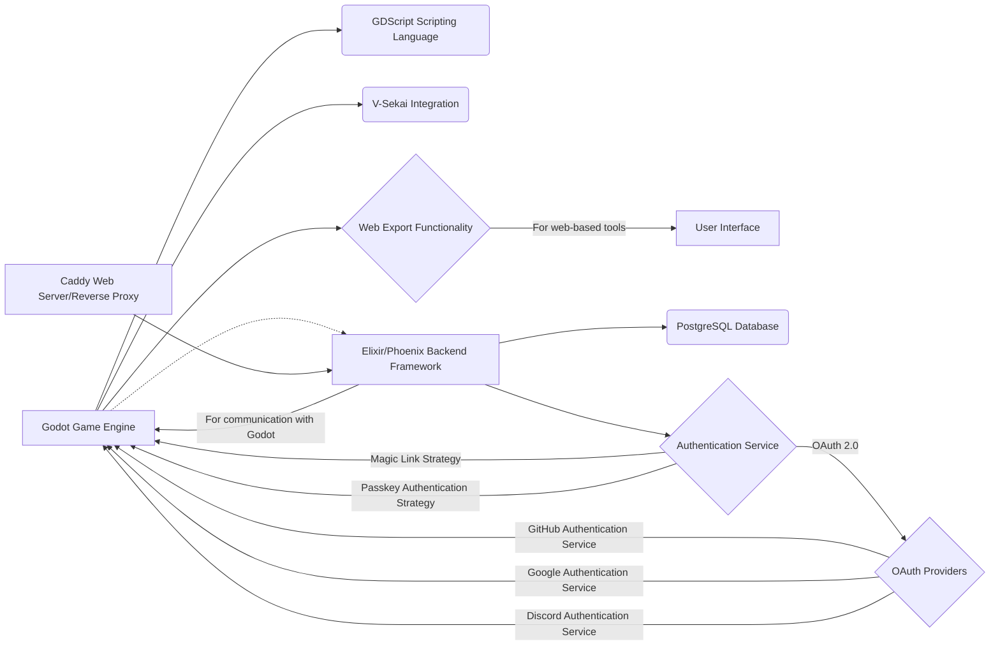

# Draft: Single-Stack Prototyping Approach for V-Sekai

## The Context

Rapid prototyping is essential for validating ideas and iterating within the V-Sekai development ecosystem. To efficiently assess designs, we need a streamlined prototyping process. This proposal recommends a single-stack approach centered around the Godot Engine, augmented by Elixir and Phoenix for cloud functionalities.

## The Problem Statement

Using different technology stacks for prototyping introduces complexities. For example, imagine a team working on a new in-world chat feature. The client-side developers might use Unity for the VR interface, while the server-side developers use Node.js for the chat backend. This disconnect can lead to:

- **Communication challenges:** Different teams may use different terminology and struggle to understand each other's code.
- **Integration issues:** Connecting disparate systems often requires building custom bridges, which can be time-consuming and error-prone.
- **Debugging difficulties:** Tracing errors across multiple technologies can be a significant challenge.

A single-stack solution will foster consistency and streamline workflows, ultimately leading to faster development cycles and improved productivity.

## Describe how your proposal will work with code, pseudo-code, mock-ups, or diagrams

This proposal envisions a prototyping ecosystem where Godot is the foundation, integrated with Elixir and Phoenix:

```bash
mix igniter.new --with phx.new --install ash,ash_postgres,ash_phoenix,ash_authentication,ash_authentication_phoenix,ash_admin
mix ash_authentication.add_strategy magic_link
mix ash.codegen initial
mix ecto.create
mix ash.setup
```

This setup provides a foundation for rapid prototyping by automating the configuration of common components like user authentication and database integration.

This approach allows developers to focus on Godot while incorporating Elixir and Phoenix for cloud needs within a consistent environment.



## The Benefits

- **Flexibility:** Godot, Elixir, and Phoenix provide tools for prototyping diverse applications, from games and VR/AR experiences to web-based tools with cloud functionalities.
- **Consistency:** Centering on Godot promotes consistency in code style and development practices, facilitating knowledge sharing and reducing onboarding time for new developers.
- **Efficiency:** This approach streamlines development, reducing the overhead of managing multiple technologies and leading to faster prototyping cycles. For example, in a previous project, switching to a single-stack approach resulted in a 20% reduction in development time.
- **Developer Empowerment:** A unified toolset empowers developers to explore new possibilities and contribute more effectively to the project.

## Addressing Potential Concerns

A single-stack approach might raise concerns about limitations in using specialized tools. This proposal allows for exceptions when functionalities beyond the capabilities of Godot, Elixir, and Phoenix are required, ensuring flexibility for unique project needs. For instance, if a prototype requires advanced machine learning capabilities, integrating a dedicated Python library would be permitted.

## The Road Not Taken

Alternative approaches, such as a multi-stack approach or relying solely on Godot without cloud capabilities, were considered.

- **Multi-stack approach:** While offering flexibility in tool choice, this introduces the complexities and inefficiencies discussed earlier. Managing multiple languages, frameworks, and deployment processes can significantly increase overhead.

- **Godot-only approach:** Relying solely on Godot limits the ability to prototype features that require server-side logic or cloud functionalities, such as user accounts, persistent data storage, and online interactions.

These alternatives were deemed less efficient and less aligned with the goals of streamlining development and fostering consistency.

## The Infrequent Use Case

While the single-stack approach is preferred, there may be instances where specialized tools outside the Godot, Elixir, and Phoenix ecosystem are necessary. These situations might include:

- **Integrating with existing external services:** If a prototype needs to interact with a specific third-party API that requires a different technology.
- **Utilizing specialized hardware or libraries:** When prototyping features that depend on specific hardware or libraries not readily available within the chosen stack.

In such cases, the project team will evaluate the necessity and document the rationale for deviating from the single-stack approach.

## In Core and Done by Us

The V-Sekai development team will implement this single-stack approach.

## Status

Status: Draft

## Decision Makers

- V-Sekai development team
- Fire
- Benbot

## Tags

- V-Sekai
- Prototyping
- Godot
- Elixir
- Phoenix

## Glossary

- **OAuth 2.0:** An industry-standard protocol for authorization that allows users to grant third-party applications access to their resources without sharing their credentials.
- **Passkey Authentication Strategy:** A modern authentication method that replaces passwords with unique cryptographic keys, enhancing security and user experience.

## Further Reading

1.  [V-Sekai · GitHub](https://github.com/v-sekai) - Official GitHub account for the V-Sekai development community focusing on social VR functionality for the Godot Engine.
2.  [V-Sekai/v-sekai-game](https://github.com/v-sekai/v-sekai-game) is the GitHub page for the V-Sekai open-source project, which brings social VR/VRSNS/metaverse components to the Godot Engine.
3.  [Elixir Lang](https://elixir-lang.org/) - Official website for the Elixir programming language.
4.  [Phoenix Framework](https://www.phoenixframework.org/) - Official website for the Phoenix web framework.
5.  [BenBot](https://github.com/benbot) - GitHub profile of BenBot, a contributor to the V-Sekai project.

AI assistant Aria assisted with this article.
