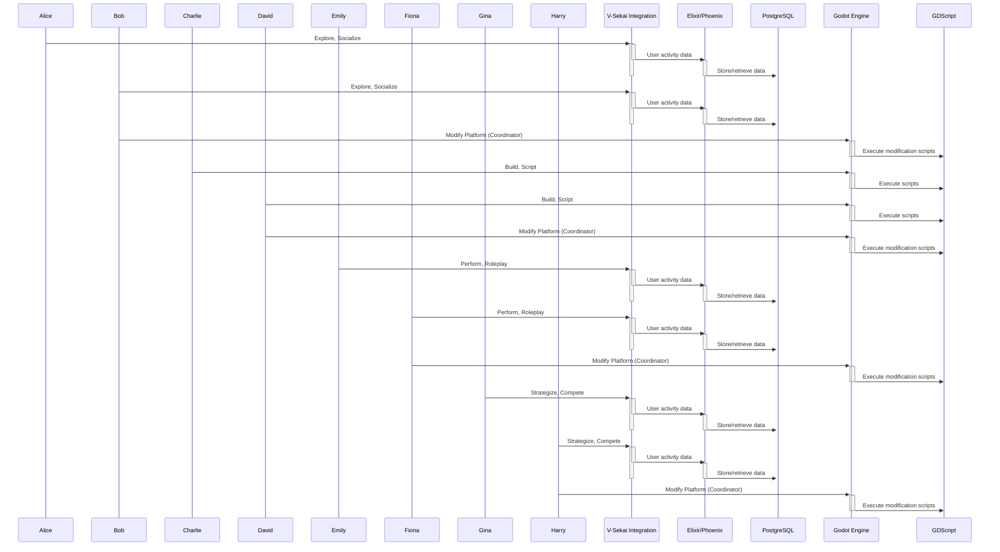

## What is the context of the proposal?

Prototyping is essential for validation and iterating within the V-Sekai development ecosystem. This proposal recommends a single-stack approach centered around the Godot Engine, augmented by Elixir and Phoenix for cloud functionalities.

## What is the problem being solved?

Even within a single-stack approach using technologies like Godot and Elixir, over-specialization can hinder prototyping. Developers may gravitate towards their areas of expertise, leading to imbalances and challenges when building features that span both client-side and server-side domains.

## Describe how your proposal will work with code, pseudo-code, mock-ups, or diagrams

This proposal envisions a prototyping ecosystem where Godot is the foundation, integrated with Elixir and Phoenix:

```bash
mix igniter.new --with phx.new --install ash,ash_postgres,ash_phoenix,ash_authentication,ash_authentication_phoenix,ash_admin
mix ash_authentication.add_strategy magic_link
mix ash.codegen initial
mix ecto.create
mix ash.setup
```



## What are the benefits of the proposal?

- **Flexibility:** Godot, Elixir, and Phoenix provide a wide range of tools for prototyping diverse applications, from games and VR/AR experiences to web-based tools with cloud functionalities.
- **Consistency:** Centering on Godot promotes consistency in code style and development practices, facilitating knowledge sharing and reducing onboarding time for new developers.
- **Efficiency:** This approach streamlines development, reducing the overhead of managing multiple technologies and leading to faster prototyping cycles.
- **Developer Empowerment:** A unified toolset empowers developers to explore new possibilities and contribute more effectively to the project.

## What are the downsides of the proposal?

- **Limited Flexibility in Technology Choices:** Adopting a single-stack approach may restrict the incorporation of other technologies better suited for specific requirements.
- **Learning Curve:** Developers may need to become proficient in both client-side and server-side technologies, requiring additional training and time.

## What are the alternative proposals?

Alternative approaches, such as a multi-stack approach or relying solely on Godot without cloud capabilities, were considered.

- **Multi-stack approach:** While offering flexibility in tool choice, this introduces complexities and inefficiencies. Managing multiple languages, frameworks, and deployment processes can significantly increase overhead.
- **Godot-only approach:** Relying solely on Godot limits the ability to prototype features that require server-side logic or cloud functionalities, such as user accounts, persistent data storage, and online interactions.

## When might the proposed solution be used rarely or not at all?

The single-stack approach may be less effective for projects requiring highly specialized technologies not supported within the Godot, Elixir, and Phoenix ecosystem, or when rapid integration with existing multi-stack systems is necessary.

## Is this a V-Sekai core responsibility, and can it be done by us?

Implementing the single-stack approach aligns with V-Sekai's core responsibilities. The development team has the expertise in Godot, Elixir, and Phoenix necessary to execute and maintain this stack, ensuring integration and functionality within the ecosystem.

## What is the status of the proposal?

Status: Proposed <!-- Draft | Proposed | Rejected | Accepted | Deprecated | Superseded by -->

## Who is making decisions on the proposal?

- V-Sekai development team
- Fire
- Benbot

## What tags does the proposal have?

- V-Sekai
- Prototyping
- Godot
- Elixir
- Phoenix

## List further reading references

1. [V-Sekai · GitHub](https://github.com/v-sekai) - Official GitHub account for the V-Sekai development community focusing on social VR functionality for the Godot Engine.
2. [V-Sekai/v-sekai-game](https://github.com/v-sekai/v-sekai-game) is the GitHub page for the V-Sekai open-source project, which brings social VR/VRSNS/metaverse components to the Godot Engine.
3. [Elixir Lang](https://elixir-lang.org/) - Official website for the Elixir programming language.
4. [Phoenix Framework](https://www.phoenixframework.org/) - Official website for the Phoenix web framework.
5. [BenBot](https://github.com/benbot) - GitHub profile of BenBot, a contributor to the V-Sekai project.

AI assistant Aria assisted with this article.
