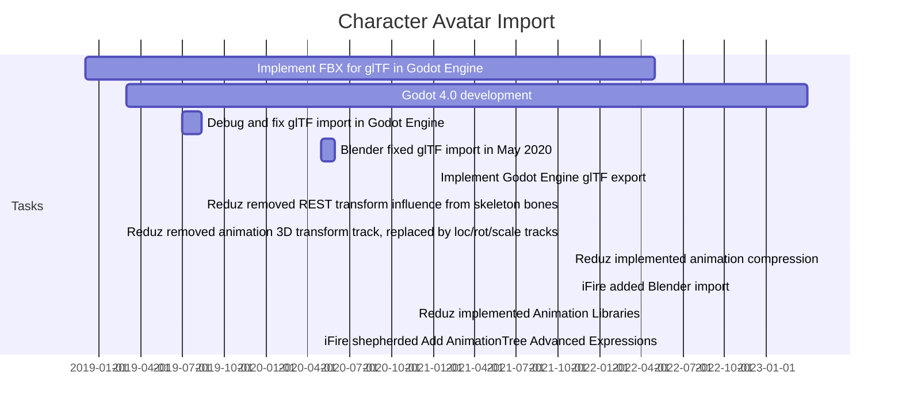

# Be an avatar and visit places

V-Sekai allows you to import worlds and explore them.

To learn how to import worlds and visit them, please refer to our documentation or reach out via our community channels.

V-Sekai supports VRM avatar files, an open-source standard for sharing portable humanoid avatars across virtual reality platforms.

Users can personalize their avatars in V-Sekai by importing models from Blender or VRoid Hub and using them as their persona within the virtual space. [VRM: Extending glTF for Portable Humanoid Avatars](https://www.khronos.org/assets/uploads/developers/presentations/VRM-Extending-glTF-for-Portable-Humanoid-Avatars_SIGGRAPH-Asia_Nov19.pdf)

## VRM glTF2 Extension Features

- XR avatars built on glTF
- Automatic humanoid rigging
- Interactive hair and clothing
- Twist bones and constraints
- Toon shading with glTF PBR
- Face shapes for speech
- Cross-engine support
- Simplified physics simulation (spring bones)
- Meta-information (author and license)
- Custom facial expressions (morphs)

## Animation Retargeting

- Import as a model or animation library
- Built-in humanoid profile
- Custom profiles (e.g., monsters, animals)
- Compatible with Mixamo and Blender animations
- Blend walk and run animations using blend spaces