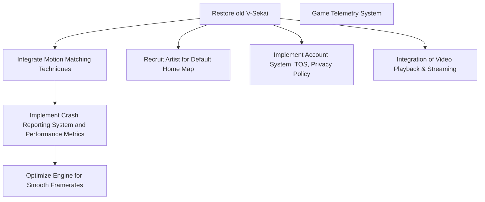

```mermaid
%% V-Sekai Social Virtual Reality Project

graph TD
    %% Define tasks and dependencies based on your project

    A[Restore old V-Sekai]
    B[Game Telemetry System]
    C[Integrate Motion Matching Techniques]
    D[Implement Crash Reporting System and Performance Metrics]
    E[Optimize Engine for Smooth Framerates]
    F[Recruit Artist for Default Home Map]
    G[Implement Account System, TOS, Privacy Policy]
    H[Integration of Video Playback & Streaming]

    A --> C
    C --> D
    D --> E
    A --> F
    A --> G
    A --> H

    %% Task styling
    classDef taskInfo fill:#f9f,stroke:#333,stroke-width:2px;
```