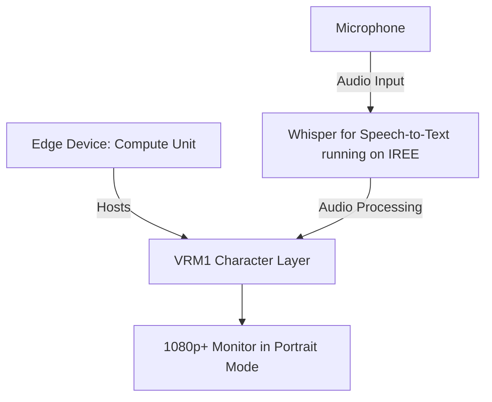

# Translation/Transcription Badge with IREE

## Overview

This project proposes the development of a precursor to a generative assistant, focusing on creating a translation/transcription badge using IREE, an MLIR-based compiler that optimizes Machine Learning (ML) models for mobile and edge deployments. The primary focus is on voice interactions and command processing.

## Key Features

1. **Voice Interactions**: The system will prioritize voice interactions, leveraging IREE's capabilities to create a responsive AI. Note that Python will not be used in this context.

2. **Speech-to-Text Interface**: A speech-to-text interface will be incorporated to process and respond to voice commands effectively.

3. **Direct Connection to Compute Module**: The display, set in portrait mode, will connect directly to the compute module, a standard Linux amd64 computer, eliminating the need for embedded software development.

4. **No Holograph Displays**: The design will be streamlined and efficient, excluding holograph displays.

## Potential Challenges

The project's complexity and the expertise required in areas such as IREE, the Godot engine, and AI development pose significant challenges.

## Alternatives Not Considered

We have decided against integrating Python with IREE and using a pre-existing AI framework instead of developing one from scratch.

## Target Audience

The project may not be suitable for individuals without familiarity with IREE or a background in AI development.

## Development Strategy

The project will be developed in-house, utilizing our expertise in AI and game development.

## Further Reading

For more information, please refer to these resources:

- [V-Sekai](https://v-sekai.org/)
- [IREE on GitHub](https://github.com/openxla/iree)
- [Whisper JAX on GitHub](https://github.com/sanchit-gandhi/whisper-jax)
- [IREE JAX on GitHub](https://github.com/iree-org/iree-jax)
- [Whisper JAX on Hugging Face Spaces](https://huggingface.co/spaces/sanchit-gandhi/whisper-jax)
- [Twitter inspiration](https://twitter.com/jav6868/status/1698260873352212662?s=20)

## System Diagram

**System Diagram Explanation:**

1. The **Edge Device: Compute Unit (A)**, a standard Linux amd64 computer, hosts the **VRM1 Character Layer (B)**.
2. The **Whisper for Speech-to-Text module (C)**, running on IREE, captures audio input from the **Microphone (E)** and converts it into text.
3. This processed data is used to animate a virtual character in the VRM1 Character Layer, which can be in speaking or idle mode.
4. The resulting texts are displayed on the **1080p+ Monitor in Portrait Mode (D)**.

Please note that the system currently only supports speaking and idle states. Other modes are not available at this time.