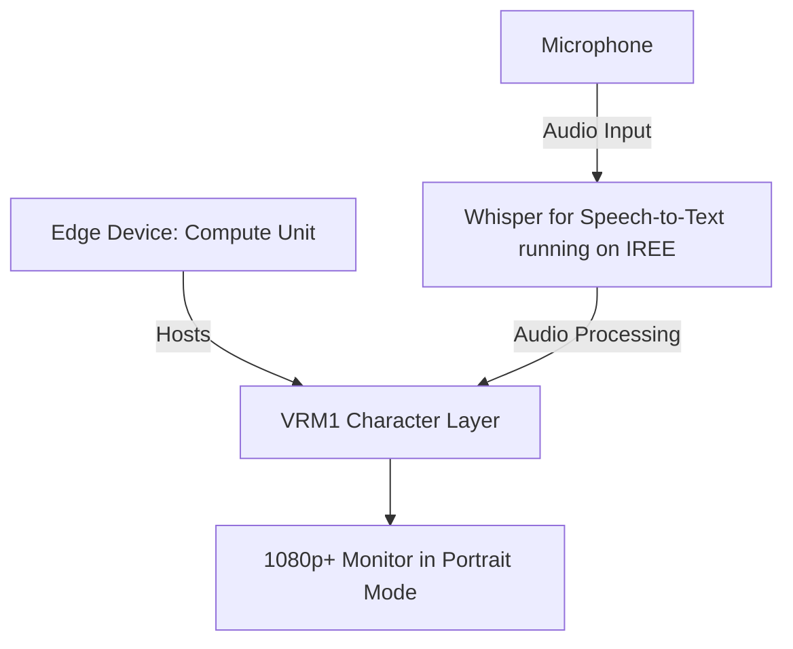

# Prototyping a Generative Assistant Screen with IREE

## Metadata

- **Status**: Proposed
- **Deciders**: V-Sekai, fire, cyberpunkmermaid
- **Tags**: `V-Sekai`

## The Backdrop

The primary challenge lies in leveraging IREE, an MLIR-based end-to-end compiler that lowers Machine Learning (ML) models to a unified IR optimized for mobile and edge deployments, for both conversation interactions (openllama) and voice commands (whisper). Our objective is to develop a digital assistant, but the intricacies of game development present significant obstacles.

## The Challenge

Our proposed strategy is to concentrate solely on voice interactions and a speech-to-text interface using IREE, excluding Python. This approach necessitates a profound understanding of IREE and its applications in creating an interactive and responsive AI capable of effectively processing and responding to voice commands.

We aim to bypass embedded software development and connect the portrait mode display directly to the compute module, while also avoiding holograph displays.

The potential upside is the creation of a unique digital assistant that harnesses the power of generative AI. This could revolutionize how we interact with technology and open up new possibilities in the field of AI.

## The Downside

The project's complexity and difficulty are the main drawbacks. It demands a high level of expertise and knowledge in several areas, including IREE, the Godot engine, and AI development.

## The Road Not Taken

One alternative considered but not pursued was integrating Python alongside IREE. While Python is a powerful and versatile language that could have added more flexibility to the project, it was ultimately decided that focusing solely on IREE would allow for a more specialized and optimized system. Another unexplored option was using a pre-existing AI framework instead of building one from scratch. This could have saved time and resources, but it would have limited the customization and unique features of our digital assistant.

## The Infrequent Use Case

This project may not be suitable for those unfamiliar with IREE or without a background in AI development.

## In Core and Done by Us?

Yes, this project will be developed in-house, leveraging our expertise in AI and game development.

## Further Reading

- [V-Sekai](https://v-sekai.org/): A platform for VRM characters.
- [IREE on GitHub](https://github.com/openxla/iree): The official repository of IREE (Intermediate Representation Execution Environment), an open-source compiler and runtime infrastructure.
- [Whisper JAX on GitHub](https://github.com/sanchit-gandhi/whisper-jax): The repository for Whisper, a Speech-to-Text module, implemented with JAX.
- [IREE JAX on GitHub](https://github.com/iree-org/iree-jax): The IREE JAX API provides a compiler and runtime bridge between JAX and IREE. It allows programs to be extracted and compiled from JAX for deployment with IREE, without a Python or JAX dependency.
- [Whisper JAX on Hugging Face Spaces](https://huggingface.co/spaces/sanchit-gandhi/whisper-jax): Whisper JAX is an optimised implementation of the Whisper model by OpenAI. It runs on JAX with a TPU v4-8 in the backend. Compared to PyTorch on an A100 GPU, it is over 70x faster, making it the fastest Whisper API available.
- [Twitter inspiration](https://twitter.com/jav6868/status/1698260873352212662?s=20): A tweet that inspired this project.
- This article is assisted by AI.

## System Diagram

**System Diagram Description:**

1. The interaction begins with the **Edge Device: Compute Unit (A)**, which hosts the **VRM1 Character Layer (B)**.
2. The **Whisper for Speech-to-Text module (C)**, now specifically running on IREE, captures audio input from the **Microphone (E)** and converts the spoken words into text.
3. This processed data is used to create a virtual character in the VRM1 Character Layer. This character can be in speaking mode or idle animation.
4. These texts are then displayed on the **1080p+ Monitor in Portrait Mode (D)**.

The system currently only supports speaking state and idle state. Other modes are not available at this time.
