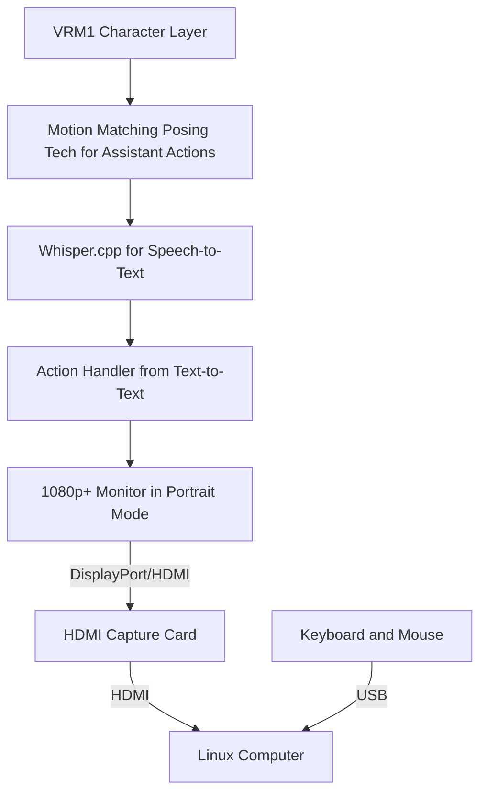

# Prototyping a Generative Assistant Screen

## Metadata

- **Status**: Proposed
- **Deciders**: V-Sekai, fire, cyberpunkmermaid
- **Tags**: `V-Sekai`

## The Backdrop

V-Sekai is a platform that enables the creation of generative AI using the Godot engine. This AI can be displayed on a device with an OLED display and incorporates various sensors and a posing compute module. The platform also supports direct importing of VRM1 avatars.

## The Challenge

The primary challenge lies in utilizing GGML for both conversation interactions (openllama) and voice commands (whisper). The objective is to develop a digital assistant, but the intricacies of game development present significant obstacles.

## The Strategy

The proposed strategy is to focus solely on voice interactions and a speech-to-text interface using GGML, excluding Python. This approach requires a deep understanding of GGML and its applications in creating an interactive and responsive AI that can effectively process and respond to voice commands.

Our goal is to avoid embedded software development and connect the portrait mode display directly to the compute module, while also steering clear of holograph displays.

## The Upside

The potential benefit is the creation of a unique digital assistant that harnesses the power of generative AI. This could transform how we interact with technology and pave the way for new possibilities in the field of AI.

## The Downside

The project's complexity and difficulty are the main drawbacks. It demands a high level of expertise and knowledge in several areas, including GGML, the Godot engine, and AI development.

## The Road Not Taken

One alternative considered but not pursued was integrating Python alongside GGML. While Python is a powerful and versatile language that could have added more flexibility to the project, it was ultimately decided that focusing solely on GGML would allow for a more specialized and optimized system. Another unexplored option was using a pre-existing AI framework instead of building one from scratch. This could have saved time and resources, but it would have limited the customization and unique features of our digital assistant.

## The Infrequent Use Case

This project may not be suitable for those unfamiliar with GGML or without a background in AI development.

## In Core and Done by Us?

Yes, this project will be developed in-house, leveraging our expertise in AI and game development.

## Further Reading

- [V-Sekai](https://v-sekai.org/)
- [GGML on GitHub](https://github.com/ggerganov/ggml)
- [Twitter inspiration](https://twitter.com/jav6868/status/1698260873352212662?s=20)
- This article is assisted by AI.

## System Diagram

Here is the merged Mermaid diagram to illustrate the complete system setup:

In this diagram:
- The VRM1 Character Layer connects to the Motion Matching Posing Tech for Assistant Actions.
- The Motion Matching Posing Tech then connects to Whisper.cpp for Speech-to-Text.
- The Whisper.cpp for Speech-to-Text connects to the Action Handler from Text-to-Text.
- The Action Handler from Text-to-Text outputs to a 1080p+ Monitor set in portrait mode, which connects to the HDMI Capture Card via DisplayPort or HDMI.
- The HDMI Capture Card then connects to the Linux computer via HDMI.
- The keyboard and mouse are connected to the Linux computer via USB.
- All cables (usb-c and others) must be compliant with the capture card.