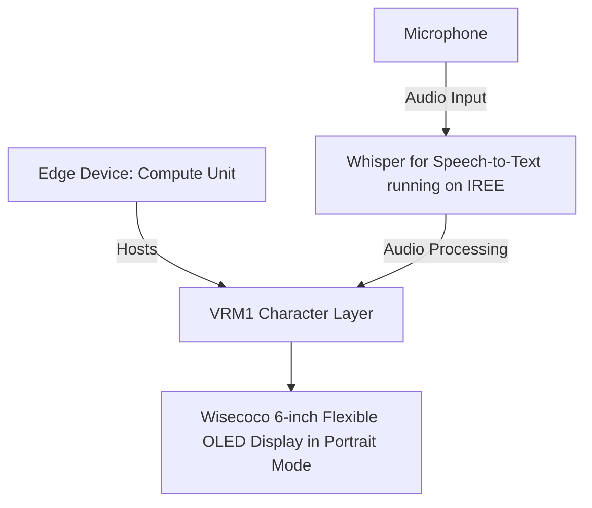

# Translation/Transcription Badge with IREE

## Overview

The project aims to develop a translation/transcription badge using IREE, an MLIR-based compiler that optimizes Machine Learning (ML) models for mobile and edge deployments. The primary focus is on voice interactions.

## Key Features

- **Voice Interactions**: The system will prioritize voice interactions, leveraging IREE's capabilities to create a responsive AI. Python will not be used in this context.
- **Speech-to-Text Interface**: A speech-to-text interface will be incorporated to process voice inputs effectively.
- **Direct Connection to Compute Module**: The display, set in portrait mode, will connect directly to the compute module, a standard Linux amd64 computer, eliminating the need for embedded software development.
- **Flexible OLED Display**: The system will utilize a 6-inch flexible OLED display from Wisecoco with a resolution of 2880\*1440 at 60Hz refresh rate. This display offers a wide viewing angle of 178 degrees and can be wall-mounted.
- **No Holograph Displays**: The design will be streamlined and efficient, excluding holograph displays.

## Potential Challenges

The project's complexity and the expertise required in areas such as IREE, the Godot engine, and AI development pose significant challenges.

## Alternatives Not Considered

We have decided against integrating Python with IREE and using a pre-existing AI framework instead of developing one from scratch.

## Target Audience

The project may not be suitable for individuals without familiarity with IREE or a background in AI development.

## Development Strategy

The project will be developed in-house, utilizing our expertise in AI and game development.

## Further Reading

For more information, please refer to these resources:

- [V-Sekai](https://v-sekai.org/)
- [IREE on GitHub](https://github.com/openxla/iree)
- [Whisper JAX on GitHub](https://github.com/sanchit-gandhi/whisper-jax)
- [IREE JAX on GitHub](https://github.com/iree-org/iree-jax)
- [Whisper JAX on Hugging Face Spaces](https://huggingface.co/spaces/sanchit-gandhi/whisper-jax)
- [Twitter inspiration](https://twitter.com/jav6868/status/1698260873352212662?s=20)
- [wisecoco 6 inch 2K Flexible OLED Display IPS 2880 * 1440 Flexible Screen Curved Bendable Screen](https://www.amazon.ca/wisecoco-Flexible-Display-Screen-Bendable/dp/B0C7YY16Z5)

## System Diagram

**System Diagram Explanation:**

1. The **Edge Device: Compute Unit (A)**, a standard Linux amd64 computer, hosts the **VRM1 Character Layer (B)**.
2. The **Whisper for Speech-to-Text module (C)**, running on IREE, captures audio input from the **Microphone (E)** and converts it into text.
3. This processed data is used to animate a virtual character in the VRM1 Character Layer, which can be in speaking or idle mode.
4. The resulting texts are displayed on the **Wisecoco 6-inch Flexible OLED Display in Portrait Mode (D)**.

Please note that the system currently only supports speaking and idle states. Other modes are not available at this time.

The choice of portrait mode for the display aligns with the specific needs and constraints of your project. Given that your project heavily relies on text-based interactions, specifically transcriptions, portrait mode allows more lines of text to be visible at once, improving the user experience. The system will utilize a 6-inch flexible OLED display from Wisecoco, which can be wall-mounted. Portrait mode is more space-efficient in such scenarios, taking up less horizontal space while still providing ample vertical space for text display. Considering that the primary focus of your project is voice interactions, the display mode should ideally support easy reading of transcriptions. Portrait mode, with its vertical orientation, is more suited to this task as it mimics the natural top-to-bottom reading flow. As per your system diagram, the processed data from the Whisper for Speech-to-Text module running on IREE is used to animate a virtual character and display resulting texts. Given that these texts are likely to be dialogue or conversation-based, portrait mode would allow for a more coherent and continuous display of these text blocks.
